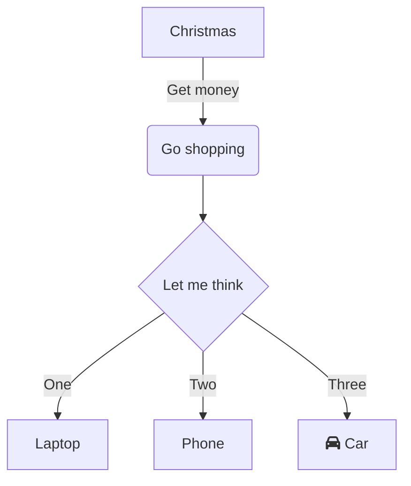

# Paragraphs

Any line with blank lines before and after it is a paragrah,
consequent lines are joined.

You need a blank line for a new paragraph.

# Separators

---

# Heading (h1) 

## Heading (h2) 

### Heading (h3) 

#### Heading (h4) 

##### Heading (h5) 

###### Heading (h6) 

# Text decoration

**This is bold text**

__This is bold text__

*This is italic text*

_This is italic text_

~~This is dashed text~~

<https://nt.web.ve>

[This is a link](https://nt.web.ve)

[This is a link with a title](https://nt.web.ve "This is the title!").

[ntweb]: https://nt.web.ve

[ntweb][]

[My site][ntweb]

# Lists

* Create a list by starting a line with `+`, `-`, or `*`
* Sub-lists are made by indenting 2 spaces:
  * This is a sublist
* And everything become normal again

1. This is
2. an ordered
3. list

* [ ] This is
* [x] a task list

This
: is a definition list.

Term:
: definition, you can add the `:` in the term.

# Quotes

This paragraph has a footnote[^1].

[^1]: And here is the footnote.

> Block quotes are
> written like so.
>
> They can span multiple paragraphs, if you like.
>
> And **Markdown**!.
>
> -- The Author

# Tables

| Heading | Another heading |
| ------- | --------------- |
| text    | text            |
| text    | text            |
| text    | text            |

| Heading | Another heading |
| :-----: | :-------------: |
|  text   |      text       |
|  text   |      text       |
|  text   |      text       |

| Heading | Another heading |
| ------: | --------------: |
|    text |            text |
|    text |            text |
|    text |            text |

# Images


# Math formulas

This is a smart fraction 1/2, this is text with inline math
\\(\sum\_{n=1}^{\infty} 2^{-n} = 1\\) and this is a math block:

$$
\sum\_{n=1}^{\infty} 2^{-n} = 1
$$

# Code

Inline `code`.

```go {linenos=true,hl_lines=["1", "5-7"],linenostart=0}
package main

import "fmt"

func main() {
  fmt.Println("hello, world")
}
```

# Shortcodes

## Keyboard

 +  + 

## Images

### Inline

Inline image with 

### Wide



### Block (center aligned)



### Left aligned



Lorem ipsum dolor sit amet, consectetur adipisicing elit, sed do eiusmod
tempor incididunt ut labore et dolore magna aliqua. Ut enim ad minim veniam,
quis nostrud exercitation ullamco laboris nisi ut aliquip ex ea commodo
consequat. Duis aute irure dolor in reprehenderit in voluptate velit esse
cillum dolore eu fugiat nulla pariatur. Excepteur sint occaecat cupidatat non
proident, sunt in culpa qui officia deserunt mollit anim id est laborum.

### Right aligned



Lorem ipsum dolor sit amet, consectetur adipisicing elit, sed do eiusmod
tempor incididunt ut labore et dolore magna aliqua. Ut enim ad minim veniam,
quis nostrud exercitation ullamco laboris nisi ut aliquip ex ea commodo
consequat. Duis aute irure dolor in reprehenderit in voluptate velit esse
cillum dolore eu fugiat nulla pariatur. Excepteur sint occaecat cupidatat non
proident, sunt in culpa qui officia deserunt mollit anim id est laborum.

## Figures

### Wide



### Block (center aligned)



### Left aligned



Lorem ipsum dolor sit amet, consectetur adipisicing elit, sed do eiusmod
tempor incididunt ut labore et dolore magna aliqua. Ut enim ad minim veniam,
quis nostrud exercitation ullamco laboris nisi ut aliquip ex ea commodo
consequat. Duis aute irure dolor in reprehenderit in voluptate velit esse
cillum dolore eu fugiat nulla pariatur. Excepteur sint occaecat cupidatat non
proident, sunt in culpa qui officia deserunt mollit anim id est laborum.

### Right aligned



Lorem ipsum dolor sit amet, consectetur adipisicing elit, sed do eiusmod
tempor incididunt ut labore et dolore magna aliqua. Ut enim ad minim veniam,
quis nostrud exercitation ullamco laboris nisi ut aliquip ex ea commodo
consequat. Duis aute irure dolor in reprehenderit in voluptate velit esse
cillum dolore eu fugiat nulla pariatur. Excepteur sint occaecat cupidatat non
proident, sunt in culpa qui officia deserunt mollit anim id est laborum.

## Go Playground


```go
package main

import "fmt"

func main() {
  fmt.Println("hello, world")
}
```


## Notes


This is a note.



This is a **note** with a custom title.


## Links of interest


* <https://nt.web.ve>
* <https://nt.web.ve/en/>
* <https://nt.web.ve/es/>


## Details


**Lorem ipsum** dolor sit amet, consectetur adipisicing elit, sed do eiusmod
tempor incididunt ut labore et dolore magna aliqua. Ut enim ad minim veniam,
quis nostrud exercitation ullamco laboris nisi ut aliquip ex ea commodo
consequat. Duis aute irure dolor in reprehenderit in voluptate velit esse
cillum dolore eu fugiat nulla pariatur. Excepteur sint occaecat cupidatat non
proident, sunt in culpa qui officia deserunt mollit anim id est laborum.



**Lorem ipsum** dolor sit amet, consectetur adipisicing elit, sed do eiusmod
tempor incididunt ut labore et dolore magna aliqua. Ut enim ad minim veniam,
quis nostrud exercitation ullamco laboris nisi ut aliquip ex ea commodo
consequat. Duis aute irure dolor in reprehenderit in voluptate velit esse
cillum dolore eu fugiat nulla pariatur. Excepteur sint occaecat cupidatat non
proident, sunt in culpa qui officia deserunt mollit anim id est laborum.


# Charts





## Snippets



{{< snippet "files/hello.go" "go {linenos=true,hl_lines=[\"1\", \"5-7\"],linenostart=0}" >}}



## Cards



