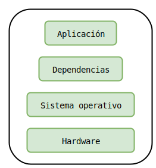
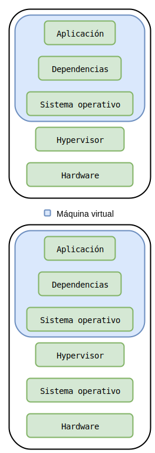
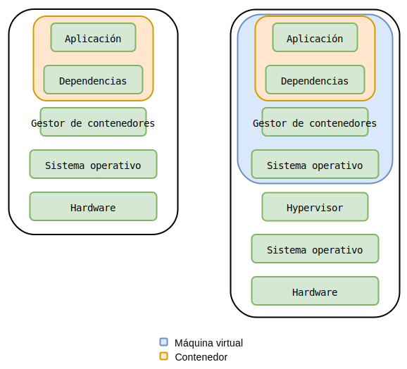

.. site-description: Básicamente, le permiten a los programadores y administradores de sistemas desarrollar e implementar aplicaciones de una manera mucho más sencilla.

.. role:: emoji

============
Contenedores
============

:Author: Miguel Angel Rivera Notararigo
:Contact: `@ntrrg </es/autores/ntrrg/>`_
:Date: 2018-04-08T01:14:00-04:00
:Category: tecnologia
:Tags: backend; contenedores; devops; entornos-de-desarrollo; sysadmin;

Básicamente, le permiten a los programadores y administradores de sistemas
desarrollar e implementar aplicaciones de una manera mucho más sencilla. Antes
de entrar en detalles sobre el tema y para poder notar las ventajas de usar
contenedores, haré un ejemplo de como se implementaría una aplicación web (no
es que los contenedores solo sirvan para aplicaciones web, es un ejemplo) con
otros métodos:

**Con servidores físicos (bare-metal)**

#. El programador escribe la aplicación en su computadora.
#. El programador se asegura de que la aplicación funciona en su computadora.
#. El programador sube el código fuente al repositorio Git.

#. El administrador de sistemas clona el repositorio en el servidor de pruebas
   o si se tiene automatizado, se clona automáticamente.

#. El administrador de sistemas inicia la instalación de la aplicación y sus
   dependencias (otras aplicaciones, archivos, carpetas y cualquier otra cosa
   que necesite la aplicación para instalarse y ejecutarse) en el servidor
   siguiendo las instrucciones o corriendo algún script del programador.

#. Todos los integrantes del equipo hacen una plegaría al dios de su creencia y
   esperan que todo salga bien.

#. Existen dos posibilidades en este punto:

   * La instalación finaliza correctamente, se ejecutan las pruebas y se
     generan dos nuevas posibilidades:

     * La aplicación funciona correctamente y se migra al servidor de
       producción.

     * Ocurre un error durante las pruebas porque las dependencias de ejecución
       no se cumplen y el programador dice *«Que raro, en mi máquina sí
       funciona»*. Existen dos posibilidades por las que falló:

       * Al programador se le olvidó que la aplicación durante su ejecución
         necesitaba X dependencia, pero como en su máquina ya estaba antes de
         empezar a desarrollar, nunca se generó el error.

       * El administrador de sistemas se salto accidentalmente una de las
         instrucciones del programador y dice *«Esto no es es mi culpa, díganle
         al programador ese que aprenda a programar bien»*.

   * Ocurre un error durante la instalación porque las dependencias de
     instalación no se cumplen y el programador dice *«Que raro, en mi máquina
     sí se instala»*. Existen dos posibilidades por las que falló:

     * Al programador se le olvidó que la aplicación durante la instalación
       necesitaba X dependencia, pero como en su máquina ya estaba antes de
       empezar a desarrollar, nunca se generó el error.

     * El administrador de sistemas se saltó accidentalmente una de las
       instrucciones del programador y dice *«Esto no es es mi culpa, díganle
       al programador ese que haga bien su trabajo y explique mejor como se
       debe instalar»* (solo aplica si no se usa un script de instalación).

Sin contar que cada programador que forme parte del equipo tendrá que hacer lo
mismo que el administrador de sistemas, solo que en su computadora. El
resultado, una estructura parecida a:

Ventajas:

#. La aplicación trabajará al máximo rendimiento posible.

#. La aplicación tiene acceso directo al hardware (para algunas aplicaciones
   esto puede ser una desventaja).

Desventajas:

.. |mr-robot| image:: images/mr-robot.png
    :alt: Mr. Robot
    :height: 1.5em
    :target: http://www.usanetwork.com/mrrobot

#. Las probabilidades de fallo son muy altas.

#. El equipo debe estar muy organizado para evitar otro tipo de fallas (las de
   la aplicación no son las únicas que podrían generarse).

#. Si alguien rompe la seguridad de la aplicación (que no es que sea fácil de
   hacer, solo es en el caso de que logren hacerlo), tendrá acceso directo al
   servidor y no es que haga falta ser super usuario o |mr-robot| para
   afectarlo, con solo correr ``while true; do; echo 'Soy un come CPU Muajaja!
   😈'; done`` ya habrá un consumo relevante de CPU que podría aumentar su
   temperatura; o con otros truquitos que afecten la RAM, el espacio de
   almacenamiento, etc...

**Con máquinas virtuales:**

#. El administrador de sistemas le asigna una imagen base de una máquina
   virtual al programador para que la replique en su computadora o en el peor
   de los casos, le crea una máquina virtual en donde podrá conectarse de
   manera remota.

#. El programador escribe la aplicación en su computadora.

#. El programador se asegura de que la aplicación funciona en la máquina
   virtual.

#. El programador sube el código fuente al repositorio Git.

#. El programador genera una imagen con la aplicación funcionando y la entrega
   al administrador de sistemas para que la implemente o si se tiene
   automatizado, se crea una nueva máquina virtual de pruebas basada en la
   imagen. En caso de que se le haya asignado una máquina virtual, deberá
   avisar al administrador de sistemas para que inicie la auditoría.

#. El administrador de sistemas, y tal vez otros miembros del equipo, auditan
   la aplicación y si todo funciona correctamente se implementa en producción.

De esta manera las probabilidades de fallo al momento de la instalación y
ejecución se reducen casi a 0%, por lo que cuando un nuevo programador quiera
trabajar sobre el proyecto, no le será difícil configurar un entorno local. Se
generan dos estructuras, la primera para el entorno de producción y la otra en
la computadora de cada programador:

.. image:: images/architectures-vm.svg
    :alt: Arquitectura de una aplicación en máquinas virtuales
    :align: center
    :class: large-screen

Ventajas:

#. Las probabilidades de fallo son muy bajas (o hasta nulas).

#. Si alguien rompe la seguridad de la aplicación, solo tendrá acceso a la
   máquina virtual y no afectará a otros servicios.

#. No hace falta que el equipo esté tan organizado para implementar una versión
   de la aplicación.

Desventajas:

#. El host (que es la máquina real, donde están ejecutándose las máquinas
   virtuales) estará corriendo múltiples sistemas operativos, lo que se traduce
   en muchas más tareas para el CPU y un mayor consumo de RAM.

#. La aplicación no tiene acceso al hardware (dependiendo de la aplicación,
   esto puede ser irrelevante e incluso una ventaja), según el software de
   virtualización que se use, pueden hacerse algunas configuraciones especiales
   que le otorguen acceso, pero en este caso sería mucho mejor usar otra
   alternativa para implementar la aplicación, si quieren acceso al hardware
   para que virtualizarlo :emoji:`😒` (a menos que usen Windows).

.. admonition:: Nota

    Ya se que todo lo que escribí depende de la técnica de trabajo de cada
    equipo, pero es un ejemplo.. no hay que ser fastidiosos :emoji:`😒😂`,
    imaginen que están viendo una de esas publicidades exageradas de productos
    como *«La aspiradora que también lava, hace la comida y le canta canciones
    de cuna»*, igual que ellos, yo también tengo que vender mí producto
    :emoji:`😄`.

.. raw:: html

    <h3 style="text-align: center">¡¡POR FIN CONTENEDORES!! 😂</h3>

Ahora que ya hay algo de contexto, los contenedores pueden definirse como
entornos aislados y previamente configurados en los que se ejecutará
determinado software sin tener que preocuparse por cumplir sus dependencias
(son los *Plug & Play* del software). Su funcionalidad es muy parecida a la de
las máquinas virtuales, solo que en este caso no se virtualiza el hardware y
comparten el sistema operativo del host (esto quiere decir que los contenedores
no tienen sistema operativo, sino que usan el del host), lo que los hace mucho
más ligeros y fáciles de compartir con el equipo de trabajo.

.. admonition:: Nota

    No se debe confundir sistema operativo con distribuciones. El sistema
    operativo es Linux (el kernel) y Alpine, Arch, CentOS, Debian, Deepin,
    Elementary, Fedora, Mind, Ubuntu, :math:`etc \times 10e^\infty` :emoji:`😂`
    son distribuciones, que se encargan de agregar aplicaciones sobre Linux
    para facilitar su uso. Todos los contenedores corren el mismo sistema
    operativo, pero pueden tener diferentes distribuciones.

    .. image:: images/os-definition.svg
        :alt: Sistema operativo
        :align: center

Haré un ejemplo de implementación con contenedores igual a los anteriores para
ver sus ventajas y desventajas:

#. El administrador de sistemas le asigna una imagen base de un contenedor al
   programador para que la replique en su computadora.

#. El programador escribe la aplicación en su computadora.

#. El programador se asegura de que la aplicación funciona en el contenedor.

#. El programador sube el código fuente al repositorio Git.

#. El programador genera una imagen con la aplicación funcionando y la entrega
   al administrador de sistemas para que la implemente o si se tiene
   automatizado, se crea un nuevo contenedor de pruebas basado en la imagen.

#. El administrador de sistemas, y tal vez otros miembros del equipo, auditan
   la aplicación y si todo funciona correctamente se implementa en producción.

Los pasos son casi iguales a como se harían usando máquinas virtuales. En este
caso, las estructuras del entorno de desarrollo y de producción son iguales,
con la excepción de los programadores que usen Windows o macOS, pero dudo que
les importe el consumo desproporcionado de recursos, normalmente tienen un
hardware potente, por algo usan Windows o macOS no? :emoji:`😅`:

.. image:: images/architectures-container-small.svg
    :alt: Arquitectura de una aplicación en contenedores
    :align: center
    :class: small-screen media-screen

Ventajas:

#. Las probabilidades de fallo son muy bajas (o hasta nulas).

#. La aplicación trabajará al máximo rendimiento posible.

#. Si alguien rompe la seguridad de la aplicación, solo tendrá acceso al
   contenedor y no afectará a otros servicios.

#. La aplicación puede tener acceso al hardware según se configure (no aplica
   para Windows).

#. No hace falta que el equipo esté tan organizado para implementar una versión
   de la aplicación.

Desventajas:

#. La barrera de seguridad entre el host y los contenedores no es tan grande
   como la de una máquina virtual.

#. Hace falta que el equipo de trabajo aprenda a usar las herramientas de
   manejo de contenedores.

Existen muchas herramientas para manipular contenedores y cada una tiene
métodos específicos de trabajar con ellos, pero normalmente todas tienen un
ciclo de trabajo parecido a este:

#. Se crea o descarga una imagen de contenedor, que es una especie de plantilla
   que contiene todas las configuraciones y la estructura del sistema de
   archivos (las carpetas y esas cosas).

#. Se implementa la imagen (que es lo mismo que crear un contenedor con la
   imagen, solo que en lenguaje más pompudo :emoji:`😂`).

#. Se inicia y ejecutan los procesos del contenedor.

#. Si el contenedor terminó de ejecutar sus procesos u ocurrió un error, se
   detiene.

#. Si se (re)quiere, se reinicia el contenedor.

#. Si el contenedor ya no es de utilidad, se elimina.

Algunas de las herramientas más conocidas son:

* `Docker <../docker/>`_
* `rkt <https://coreos.com/rkt/>`_
* `runC <https://github.com/opencontainers/runc>`_
* `systemd-nspawn <https://www.freedesktop.org/software/systemd/man/systemd-nspawn.html>`_

Por la gran popularidad que se han ganado y lo bien que hacen su trabajo,
muchas empresas han estado preparando sus plataformas para trabajar con esta
tecnología, y durante ese proceso se han ido generando nuevas herramientas
llamadas orquestadores de contenedores, que automatizan gran parte de las
tareas repetitivas al momento de llevar los contenedores a entornos de
producción, algunas de estas herramientas son:

* `Docker Swarm <docker-swarm.html>`_
* `Kubernetes <https://kubernetes.io/>`_
* `Mesos <http://mesos.apache.org/>`_
* `Mesosphere <https://mesosphere.com/product/>`_
* `Nomad <https://www.nomadproject.io/>`_

|pb|

En conclusión
=============

A pesar de que todo lo que escribí pareciera una charla de Herbalife y que la
única solución a todos los problemas (hasta el hambre y la pobreza mundial) se
solucionan con contenedores, cada uno de los métodos de implementación que usé
de ejemplo tienen propósitos y enfoques diferentes, por lo que al usarlos como
y donde deben, pueden mitigarse sus desventajas y obtener más ventajas que
usando contenedores. Lo importante es siempre saber cuando usar la herramienta
correcta, y conocer una nueva que hace muy bien su trabajo nunca está de más
:emoji:`😄`.

.. image:: images/architectures.svg
    :alt: Arquitecturas de una aplicación según su implementación
    :align: center
    :class: large-screen

.. image:: images/architectures-small.svg
    :alt: Arquitecturas de una aplicación según su implementación
    :align: center
    :class: small-screen media-screen

Atribuciones
============

Escribiendo este artículo uso/usé:

__ `Docker site`_

* `Debian <https://www.debian.org/>`_

* `XFCE <https://xfce.org/>`_

* `Terminator <https://gnometerminator.blogspot.com/p/introduction.html>`_

* `Zsh <http://www.zsh.org/>`_

* `GNU Screen <https://www.gnu.org/software/screen/>`_

* `Sublime Text 3 <https://www.sublimetext.com/3>`_

* `NtDocutils <https://ntrrg.github.io/NtDocutils/>`_

* `Chrome <https://www.google.com/chrome/browser/desktop/index.html>`_

* `Draw.io <https://www.draw.io/>`_

* Docker__

**OCI Team.** *OCI Runtime Specification.* https://github.com/opencontainers/runtime-spec

**Docker Team.** *Get Started, Part 1: Orientation and setup.* https://docs.docker.com/get-started/#containers-and-virtual-machines

**Wikipedia Authors.** *Operating system.* https://en.wikipedia.org/wiki/Operating_system

.. _Docker site: https://docker.com

.. |pb| raw:: html

    

.. |lb| raw:: html

     

.. raw:: html

    
