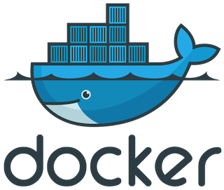

.. site-description: Es una plataforma para la ejecución y manejo de contenedores; es la utilidad más popular entre las de su tipo, por lo que muchos sitios y aplicaciones ofrecen facilidades o compatibilidad con Docker.

.. role:: emoji

============
[WIP] Docker
============

-------
17.12.1
-------

:Author: Miguel Angel Rivera Notararigo
:Contact: `@ntrrg </es/autores/ntrrg/>`_
:Date: 2018-04-01T20:00:00-04:00
:Category: tecnologia
:Tags: backend; contenedores; devops; docker; entornos-de-desarrollo; sysadmin;

__ `Docker site`_
__ `Docker documentation`_

Es una plataforma para la ejecución y manejo de contenedores; es la utilidad
más popular entre las de su tipo, por lo que muchos sitios y aplicaciones
ofrecen facilidades o compatibilidad con Docker. Si quieren obtener aun más
información de la que les doy aquí (que por cierto hay muuuucha más), pueden ir
al `sitio oficial`__ o a su documentación__.

En caso de que no estén muy familiarizados con los contenedores, les recomiendo
que le den una leída a `Contenedores <../contenedores>`_ antes de empezar con
este artículo.

.. contents:: Tabla de contenido

Instalación
===========

__ https://docs.docker.com/install/

En la `documentación oficial`__ se muestran varios métodos de instalación, pero
el más sencillo es:

.. code:: shell-session
    :class: fl fl-debian-buster

    $ wget -cO 'docker-ce_v17.12.1.deb' https://goo.gl/e7sWpF

.. code:: shell-session
    :class: fl fl-debian-stretch

    $ wget -cO 'docker-ce_v17.12.1.deb' https://goo.gl/nGTCNW

Antes de instalar, es recomendable verificar que el archivo se descargó
correctamente y que además sea el verdadero, para esto se puede usar el comando
``md5sum``, la salida debe ser exactamente igual en cualquier computadora:

.. code:: shell-session
    :class: fl fl-debian-buster

    $ md5sum 'docker-ce_v17.12.1.deb'

.. code:: shell-session
    :class: fl fl-debian-buster

    c16fd7a1d8bfe2c38b284404fdf3e7b4  docker-ce_v17.12.1.deb

.. code:: shell-session
    :class: fl fl-debian-stretch

    $ md5sum 'docker-ce_v17.12.1.deb'

.. code:: shell-session
    :class: fl fl-debian-stretch

    82cebfdf7a078bb1361c7cce789c8dc0  docker-ce_v17.12.1.deb

.. code:: shell-session

    # dpkg -i docker-ce_v17.12.1.deb

Con esto Docker ya debería estar instalado y listo para usarse, pero para
asegurarse de que sea así, se puede usar una imagen que tiene Docker justo con
este propósito.

.. code:: shell-session

    # docker run --rm hello-world

Después de que se descargue, la salida que se obtenga debería ser parecida a
algo como esto:

.. code:: shell-session

    Hello from Docker!
    This message shows that your installation appears to be working correctly.
    ...

.. admonition:: Nota

    Es posible descargar y correr la documentación oficial de manera local
    (puede tardar bastante en descargar, porque el logo de ballena le queda
    bastante bien :emoji:`😂`):

    .. code:: shell-session

        # docker run --name docker-docs -tip 4000:4000 docs/docker.github.io

    En caso de que se detenga el contenedor o se haya cerrado el sistema, la
    mejor forma de volver a iniciarlo es:

    .. code:: shell-session

        # docker start -i docker-docs

Por defecto, para poder usar Docker es necesario tener privilegios de super
usuario, pues durante el manejo de contenedores se realizan algunas tareas que
pueden afectar al host, pero es posible darle a un usuario normal la capacidad
de usar Docker agregándolo al grupo ``docker``:

.. code:: shell-session

    # usermod -aG docker ntrrg

.. admonition:: Advertencia
    :class: warning

    __ https://docs.docker.com/engine/security/security/#docker-daemon-attack-surface

    Un usuario que pertenezca al grupo ``docker`` tiene la posibilidad de
    montar el sistema de archivos raíz dentro del contenedor, y este podrá
    ser modificado sin ninguna restricción, aquí__ se puede ver más información
    sobre este tema y otras posibles fallas de seguridad.

Inicio rápido
=============

Docker permite, de una manera muy sencilla, configurar desde entornos
exageradamente complejos en los que se ejecutarán todos los servicios
necesarios para poner a funcionar una aplicación de gran alcance, hasta algo
muy básico como escribir un ``Hello world!`` en el terminal.

En las siguientes secciones mostraré cómo es el proceso para realizar algunas
de las tareas más comunes en Docker.

Crear un contenedor
-------------------

Crearé un contenedor de un servidor HTTP (`NGINX <https://www.nginx.com>`_) que
muestre una página sencilla, los pasos serían:

#. Crear una carpeta para el proyecto

   .. code:: shell-session

       $ mkdir -p ~/proyectos/reloj/

   .. code:: shell-session

       $ cd ~/proyectos/reloj/

#. Crear la página

   .. code:: shell-session

       $ subl index.html  # O su editor de texto

   ``index.html``:

   .. include:: attachments/clock.html
       :code: html
       :number-lines:

#. Crear el contenedor

   __ https://hub.docker.com/_/nginx/
   __ https://play.google.com
   __ https://en.wikipedia.org/wiki/App_Store_(iOS)

       Sr. Docker, por favor, necesito que:

   #. Use la imagen ``nginx:alpine``, que es una `imagen oficial`__ del
      proyecto NGINX, como no existe en mi computadora, búsquela en Docker Hub
      (que es como la `Play Store`__ o la `App Store`__ de los contendores) y
      descárguela.

   #. Monte la carpeta ``~/proyectos/reloj`` dentro del contenedor en la ruta
      ``/usr/share/nginx/html``, que es donde está el contenido a servir por
      NGINX.

   #. Redirija todo el tráfico del puerto ``3000`` de mi computadora al ``80``
      del contenedor.

   #. Inicie el contenedor.

   Sería genial que Docker lo entendiera si se lo dijera así ¿no? :emoji:`😂`
   pero hace falta escribirlo en su idioma para que ejecute las ordenes, que
   sería:

   .. code:: shell-session

       # docker run \
         --name reloj
         -v "${PWD}":/usr/share/nginx/html \
         -p 3000:80 \
           nginx:alpine

#. Abrir en un navegador la dirección ``http://localhost:3000``

   .. image:: images/clock.png
       :align: center

Ahora es bueno aclarar algunas cosas:

* Usé un contenedor para algo que pude haber hecho con «*Click derecho y Abrir
  con Navegador*», en analogía sería: «*Usé un reloj de miles de dolares solo
  para ver la hora*» (lo de la hora es literal :emoji:`😂`), pero bueno, si
  muchos lo hacen y a veces, si es de agujas, ni saben como leer la hora, ¿por
  qué yo no? :emoji:`😒😂`

* Realmente el ejemplo no era abrir una página, sino arrancar un servidor HTTP.

* Si el servidor HTTP necesita algunas configuraciones especiales que están
  disponibles solo en cierta versión, esta es la mejor forma de hacerlo, ya que
  cualquier miembro del equipo podrá tener un entorno acorde al de producción,
  sin importar que plataforma utilice para desarrollar o hacer pruebas.

Crear una imagen
----------------

__ https://es.wikipedia.org/wiki/Lenguaje_de_dominio_espec%C3%ADfico

Los Dockerfiles son archivos escritos con un DSL__ muy sencillo y permiten la
creación de imágenes de contenedores con un nivel de abstracción bastante alto;
suponiendo que se quiere crear una imagen que tenga ya preparado el servidor
HTTP para poner a funcionar el reloj del ejemplo anterior, los pasos a seguir
serían:

#. Ir a la carpeta del proyecto

   .. code:: shell-session

       $ cd ~/proyectos/reloj

#. Crear el Dockerfile

   .. code:: shell-session

       $ subl Dockerfile  # O su editor de texto

   ``Dockerfile``:

   .. code:: Dockerfile
       :number-lines:

       FROM nginx:alpine
       COPY index.html /usr/share/nginx/html/

#. Construir la imagen, para esto es recomendable asignarle un nombre y si se
   quiere subir a Docker Hub, debe respetar la convención
   ``usuario/nombre-imagen`` (``usuario`` debe ser el nombre de usuario que se
   use en Docker Hub)

   .. code:: shell-session

       # docker build -t ntrrg/reloj .

Ya al tener la imagen construida, solo queda compartirla para que alguien más
pueda usarla, hay dos métodos para esto, el primero es subirla a Docker Hub

.. code:: shell-session

    # docker login

.. code:: shell-session

    # docker push ntrrg/reloj

El segundo sería exportar la imagen como un paquete y copiarse como cualquier
archivo común y corriente

.. code:: shell-session

    # docker image save -o reloj.tar ntrrg/reloj

Quien reciba el paquete debe ejecutar el comando

.. code:: shell-session

    # docker image import ruta/a/reloj.tar ntrrg/reloj

Cuando se vaya a usar la imagen, sin importar cual de los métodos se haya usado
para compartirla, solo debe ejecutarse el comando

.. code:: shell-session

    # docker run -p 80:80 ntrrg/reloj

¿Cómo funciona?
===============

Aunque es usual utilizar la palabra «*Docker*» para referirse a la interfaz de
la línea de comandos (``docker COMANDO ...``), es bueno aclarar que esta es
solo uno de sus componentes y que la palabra puede referirse a tres cosas:

#. La compañía.

#. El conjunto de aplicaciones que permiten gestionar contenedores.

#. Una persona que trabaja en un puerto :emoji:`😂`.

Como yo no tengo ni la más mínima idea de cómo funcionan las compañías y mucho
menos en qué consiste el trabajo en los puertos (no vivo muy cerca de alguno
:emoji:`😅`), solo hablaré de las aplicaciones. Este conjunto de aplicaciones
crean una estructura muy robusta y eficiente, que si se va descomponiendo de
manera descendente, se obtiene algo parecido a esto:

.. image:: images/architecture.svg
    :alt: Arquitectura de Docker

Referencias
===========

* `Docker Client <cli-ref.html>`_

Atribuciones
============

Escribiendo este artículo uso/usé:

__ `Docker site`_

* `Debian <https://www.debian.org/>`_

* `XFCE <https://xfce.org/>`_

* `Terminator <https://gnometerminator.blogspot.com/p/introduction.html>`_

* `Zsh <http://www.zsh.org/>`_

* `GNU Screen <https://www.gnu.org/software/screen/>`_

* `Sublime Text 3 <https://www.sublimetext.com/3>`_

* `NtDocutils <https://ntrrg.github.io/NtDocutils/>`_

* `Chrome <https://www.google.com/chrome/browser/desktop/index.html>`_

* Docker__

**Docker Team.** *Docker Documentation.* https://docs.docker.com

**Preethi Kasireddy.** *A Beginner-Friendly Introduction to Containers, VMs and Docker.* https://medium.freecodecamp.org/a-beginner-friendly-introduction-to-containers-vms-and-docker-79a9e3e119b

.. _Docker site: https://docker.com
.. _Docker documentation: https://docs.docker.com

.. raw:: html

    
