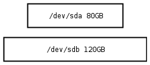
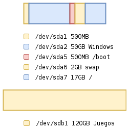
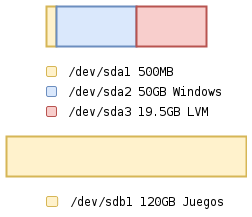
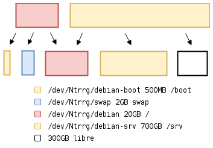

.. Roles

.. role:: emoji

===
LVM
===

--------
2.02.168
--------

:Author: Miguel Angel Rivera Notararigo
:Contact: ntrrgx@gmail.com
:Version: 0.1.0
:Date: 2017-04-08 17:10:00 -04:00

**LVM** (*«Logical Volume Manager»*) es un administrador de volúmenes lógicos
(bastante obvio después de leer su nombre no? :emoji:`😂`), esto quiere decir,
que es una herramienta para la manipulación de dispositivos de almacenamiento
con un estilo diferente a lo que normalmente se trabaja (discos y
particiones). Fue desarrollado por Heinz Mauelshagen en 1998, inspirado por
`Veritas Volume Manager`_.

Algunas de sus características son:

* Gestión de dispositivos de almacenamiento a alto nivel (más humano, menos
  máquina!), sin nombres como ``/dev/sda`` o de ese estilo.

* Facilidad para reducir/expandir (**shrink/grow**) elementos.

* `Data striping`_ (**RAID0**), que básicamente es hacer que la computadora
  piense que muchos dispositivos físicos son uno solo.

* **Snapshots**, que es una técnica bastante útil para crear backups
  (respaldos).

* Mirroring_, que en términos generales es hacer que los discos se sincronicen
  continuamente.

* **Más y más!**, pero les cuento más adelante porque si no nunca empezaré con
  el artículo :emoji:`😅`.

De particiones a LVM
====================

Para comenzar a trabajar con **LVM** es necesario entender a que me refería
con *«un estilo diferente a lo que normalmente se trabaja»*, usaré un ejemplo
para explicarlo:

    Tengo una computadora con dos discos duros, uno de 80GB y otro de 120GB;
    quiero instalar Debian y Windows solo para jugar en algunas ocasiones,
    como debería configurarlos?

.. class:: media-print

|br|

Usando el estilo trandicional de particionado yo haría algo como:

Explico un poco:

``/dev/sda1``
    Es creada automáticamente por Windows, la verdad no estoy seguro de que
    hace, pero creo que tiene algunas utilidades para el arranque.

``/dev/sda2``
    Donde se instalará Windows.

``/dev/sda5``
    Archivos de arranque para Debian.

``/dev/sda6``
    Partición para swap, el tamaño podría variar o incluso no haría falta
    crearla, pero es un tema para otro atículo.

``/dev/sda7``
    Donde se instalará Debian.

``/dev/sdb1``
    Donde se instalarán los juegos.

Con esto sería suficiente para cumplir con mis necesidades de gamer y trabajar
tranquilamente con mi buen amigo Debian, pero si quisiera inventar un poco y
montar un servidor multimedia o una pequeña nube domestica, con los pobres
17GB que le asigné durante la instalación no sería suficiente; entonces
suponiendo que un día esté caminando por la calle y de repente bajen del cielo
dos cuervos que dejen caer en mis manos una caja que contiene un disco duro de
1TB y un mensaje:

    Great power involves great responsibility.

    Asgard rules! :emoji:`😎`

    -- Óðinn

Me daría la posibilidad de comenzar a trabajar en extender mi partición, pero
que tendría que hacer? simplemente conectar el nuevo disco y hacer que mi
``/srv/`` se monte en él? si se me ocurre un nuevo invento y el servicio de la
nube está ocupando el 50% del nuevo disco, tendría que redimensionar la
partición y esperar posiblemente horas a que termine el proceso? sin mencionar
el riesgo de que se pierdan datos en el proceso.. Aquí es donde **LVM**
demuestra su poder, replantearé entonces la solución anterior:

.. class:: media-print

|br|

Se ve prácticamente igual, solo que ya no aparecen las particiones usadas por
Debian, explico:

``/dev/sda3``
    Se eliminaron las particiones relacionadas a Debian para delegar su
    control a **LVM**, esto se hace creando un grupo de volúmenes (algo
    parecido a un disco) y en él se crearán los volúmenes lógicos (algo
    parecido a particiones) que es donde se instalará el sistema.

.. class:: media-print

|br|

Ya con los volúmenes lógicos en ``/dev/Ntrrg/`` (``/dev/sda3``) debería verse
algo así:

.. image:: images/lvm-setup-vg.png
    :align: center

.. class:: media-print

|br|

Con el nuevo disco de 1TB solo sería necesario agregarlo a **LVM**:

|bp|

Y ejecutando solo un comando se podría hacer que la computadora reconozca a
``/dev/sda3`` y a ``/dev/sdc1`` como un solo grupo de volúmenes
(``/dev/Ntrrg/``), lo que me dejaría crear o extender de una manera muuuy
dinámica todos los volúmenes lógicos que necesite para mis inventos:

    La proporción de los discos está mal, pero así se puede ver con más
    facilidad la configuración.

El espacio libre lo podría utilizar para expandir los volúmenes lógicos cuando
se estén quedando sin espacio o para crear snapshots, mirroring o cache pero
esto lo explico más adelante.

Estructura
==========

__ `De particiones a LVM`_

Ya después de `familiarizarse con LVM`__ es mucho más fácil entender su
estructura, que está compuesta por:

* **Physical Volume:** (**PV**, volumen físico) es una partición o un disco
  completo que está preparado para trabajar con **LVM**, podría decirse que es
  como tener un disco atornillado en el case, listo para usarlo.

* **Volumes Group:** (**VG**, grupo de volúmenes) es un grupo de volúmenes
  físicos (aunque puede ser uno solo :emoji:`😂`) que se utilizará como
  dispositivo de almacenamiento, es equivalente a un disco; además está
  compuesto por las **Pysical Extents** (**PE**, extensiones físicas), una
  **PE** es la unidad mínima de almacenamiento en los **VG** (por defecto vale
  4MB), puede interpretarse como el espacio sin asignar del disco.

* **Logical Volume:** (**LV**, volumen lógico) es una partición virtual, creo
  que es obvio, pero representa una partición :emoji:`😂`; está compuesto por
  **Logical Extents** (**LE**, extensiones lógicas), una **LE** es una **PE**
  que está siendo usada por un **LV**, puede interpretarse como el espacio
  disponible en el que se puede guardar información.

|bp|

Referencias y atribuciones
==========================

El artículo fue escrito con `Sublime Text 3`_.

La imágenes fueron hechas con https://www.draw.io/.

**Wikipedia.** *Logical Volume Manager.* https://es.wikipedia.org/wiki/Logical_Volume_Manager

**ArchWiki.** *LVM.* https://wiki.archlinux.org/index.php/LVM

.. Links

.. _Veritas Volume Manager: https://en.wikipedia.org/wiki/Veritas_Volume_Manager
.. _Data striping: https://en.wikipedia.org/wiki/Data_striping
.. _Mirroring: https://es.wikipedia.org/wiki/RAID#RAID_1_.28Mirroring.29
.. _Sublime Text 3: https://www.sublimetext.com/3

.. Raw content

.. |br| raw:: html

     

.. |bp| raw:: html

    

.. raw:: html

    
