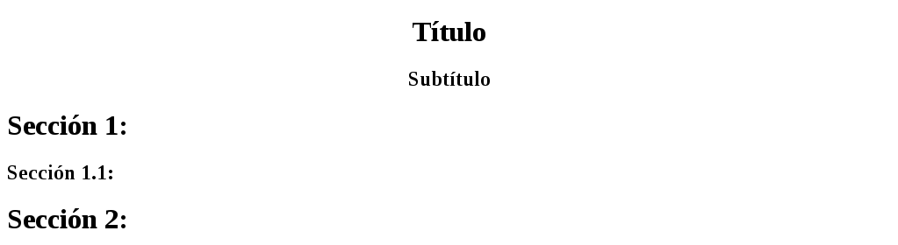
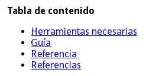
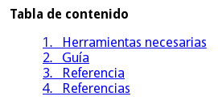

################
reStructuredText
################

:subtitle: 0.13.1
:date: 2016-12-30T22:00:00-04:00
:version: 0.5.2
:tags: Debian; Windows; Python; Docutils; Pygments; reStruturedText;
:image: /attachments/restructuredtext/image.png
:status: published

.. Raw content

.. role:: raw-html(raw)
    :format: html

.. |br| raw:: html

    <br />

.. |bp| raw:: html

    <div style="page-break-after: always"></div>

.. Syntax highlight

.. role:: html(code)
    :language: html

.. role:: py(code)
    :language: python3

.. role:: rst(code)
    :language: rest

.. role:: sh(code)
    :language: sh

.. role:: txt(code)
    :language: text

.. Custom roles

.. role:: emoji

.. Links

.. _StructuredText: http://www.zope.org/DevHome/Members/jim/StructuredTextWiki/FrontPage
.. _Setext: http://docutils.sourceforge.net/mirror/setext.html
.. _Python Doc-SIG: http://www.python.org/sigs/doc-sig/
.. _Python: http://www.python.org/
.. _Pelican: http://docs.getpelican.com/en/stable/
.. _Sublime Text 3: http://www.sublimetext.com/3
.. _Docutils: http://docutils.sourceforge.net/
.. _Pygments: http://pygments.org/
.. _Debian: https://www.debian.org/
.. _HTML: https://es.wikipedia.org/wiki/HTML
.. _LaTeX: http://www.latex-project.org/
.. _manpages: https://www.kernel.org/doc/man-pages/
.. _ODT: https://es.wikipedia.org/wiki/OpenDocument
.. _XML: https://www.w3.org/XML/
.. _S5: http://meyerweb.com/eric/tools/s5/
.. _XeLaTeX: http://scripts.sil.org/cms/scripts/page.php?site_id=nrsi&id=xetex
.. _PyPI: https://pypi.python.org/pypi
.. _PEPs: https://www.python.org/dev/peps/
.. _RFCs: http://www.faqs.org/rfcs/
.. _Virtualenv: https://pypi.python.org/pypi/virtualenv
.. _Prompt: https://es.wikipedia.org/wiki/Prompt
.. _Chrome: https://www.google.com/chrome/
.. _CSV: https://es.wikipedia.org/wiki/CSV
.. _MS-DOS: https://es.wikipedia.org/wiki/MS-DOS
.. _Windows: https://www.microsoft.com/es-es/windows/

__ http://docutils.sourceforge.net/rst.html

Es un lenguaje de marcado, esto quiere decir que se encarga de interpretar
cierta sintaxis para estilizar texto común y corriente con el fin de mejorar
su presentación (o como yo lo diría, *«hacer que se vea mostro»* :emoji:`😄`).
La extensión usada para sus archivos es :txt:`.rst`; fue desarrollado (basado
en StructuredText_ y Setext_) por David Goodger y algunos miembros del `Python
Doc-SIG`_ para utilizarlo como lenguaje oficial de documentación en Python_,
pero a pesar de esto, no es necesario programar para poder usarlo pues
actualmente es usado por algunos generadores de sitios web estáticos (por
ejemplo Pelican_) para crear contenido. Para obtener más información acerca de
*reStructuredText*, es recomendable ir a la `página oficial`__ del proyecto.


|bp|

.. sectnum::
    :suffix: .

.. contents:: Tabla de contenido

|bp|


Herramientas necesarias
=======================

#. Un editor de texto (yo uso `Sublime Text 3`_)
#. Python_ >= 3.4 y virtualenv_ >= 15.1.0
#. Docutils_ 0.13.1 y opcionalmente Pygments_ 2.1.3 para resaltar sintaxis
#. Un navegador web (yo uso Chrome_)


Docutils
--------

Instalación
+++++++++++

.. class:: os os-debian

    .. code:: sh

        mkdir ~/Entornos

    .. code:: sh

        virtualenv -p python3 ~/Entornos/docutils

    .. code:: sh

        source ~/Entornos/docutils/bin/activate

    .. code:: sh

        pip install docutils==0.13.1 Pygments==2.1.3

.. class:: os os-windows

    .. code:: bat

        virtualenv %USERPROFILE%\Entornos\docutils

    .. code:: bat

        %USERPROFILE%\Entornos\docutils\Scripts\activate

    .. code:: bat

        pip install docutils==0.13.1 Pygments==2.1.3

Uso
+++

.. code:: text

    rst2html.py [<opciones>] [<origen> [<destino>]]

Los valores predefinidos para :txt:`<origen>` y :txt:`<destino>` son la
entrada estándar y la salida estándar respectivamente, por esta razón es
opcional especificarlos.

.. admonition:: Nota

    Aunque este artículo está enfocado a :txt:`rst2html.py`, Docutils_ permite
    obtener varios tipos de archivos a partir de un :txt:`.rst`, para los que
    sufran de curiosidad académica, esta es la lista:

    * HTML_ (:txt:`rst2html.py`)
    * LaTeX_ (:txt:`rst2latex.py`)
    * manpages_ (:txt:`rst2man.py`)
    * ODT_ (:txt:`rst2odt.py`)
    * pseudo-XML (:txt:`rst2pseudoxml.py`)
    * XML_ (:txt:`rst2xml.py`)
    * S5_ (:txt:`rst2s5.py`)
    * XeLaTeX_ (:txt:`rst2xetex.py`)

Opciones
********

-i <codificación>, --input-encoding=<codificación>  Codificación de
                                                    :txt:`<origen>`. Por
                                                    defecto toma la
                                                    codificación del sistema.

-o <codificación>, --output-encoding=<codificación>  Codificación de
                                                     :txt:`<destino>`. Por
                                                     defecto es: :txt:`UTF-8`.

|br|

--initial-header-level=<nivel>  Nivel de título inicial para las secciones
                                (:html:`<h1>`, :html:`<h2>`, etc...), no afecta
                                a los títulos de documento.

--field-name-limit=<límite>  Cantidad máxima de caracteres para la primera
                             celda de las listas de campos, en caso de
                             sobrepasar el límite, la descripción del campo se
                             escribirá debajo. Si se usa :txt:`0`, no se
                             limitará.

--option-limit=<límite>  Cantidad máxima de caracteres para la primera celda
                         de las listas de opciones, en caso de sobrepasar el
                         límite, la descripción de la opción se escribirá
                         debajo. Si se usa :txt:`0`, no se limitará.

--footnote-references=<formato>  Formato para las notas de pie, recibe los
                                 valores :txt:`brackets` (predeterminado) o
                                 :txt:`superscript`, que usan los estilos «Nota
                                 :raw-html:`<a class="footnote-reference"
                                 href="#">[1]</a>`» o «Nota\ :raw-html:`<a
                                 class="footnote-reference"href="#"><sup>1
                                 </sup></a>`» respectivamente.

--attribution=<formato>  Formato en que se escribe el autor de las citas (en
                         caso de tenerlo), recibe los valores :txt:`dash`
                         (predeterminado) que le antepone un guión,
                         :txt:`parens` que lo encierra en parentesis y
                         :txt:`none` que no le agrega ningún estilo.

--no-compact-lists  No elimina el interlineado entre las listas simples.

--no-compact-field-lists  No elimina el interlineado entre las listas de
                          campos simples.

|br|

--stylesheet=<URL[,...]>  URLs de las hojas de estilo alojadas en algún
                          servidor.

--stylesheet-path=<ruta[,...]>  Rutas de las hojas de estilo, se debe
                                escribir después de la opción
                                :txt:`--stylesheet` si se usa.

--link-stylesheet  Referencia las hojas de estilo en lugar de de agregarlas
                   archivo.

--syntax-highlight=short  Se usarán clases HTML_ cortas para resaltar la
                          sintaxis, es decir, :rst:`:py:`print("Hola mundo!")``
                          no se convertirá en:

                          .. code:: html
                              :number-lines:

                              <code class="py python3">
                                <span class="keyword">print</span>
                                <span class="punctuation">(</span>
                                <span class="literal string double">"Hola mundo!"</span>
                                <span class="punctuation">)</span>
                              </code>

                          sino en:

                          .. code:: html

                              <code class="py python3">
                                <span class="k">print</span>
                                <span class="p">(</span>
                                <span class="s2">"Hola mundo!"</span>
                                <span class="p">)</span>
                              </code>


|bp|

Guía
====

Para empezar a trabajar hay que crear un archivo :txt:`.rst` con el editor de
texto

:txt:`archivo.rst`

.. code:: rest
    :number-lines:

    ######
    Título
    ######

    **Hola** *mundo*!

.. admonition:: Nota

    En la sección Referencia_ se puede ver casi toda la sintaxis disponible.

Después se debe procesar el archivo usando Docutils_

.. admonition:: Advertencia
    :class: warning

    El entorno virtual debe estar activo, para verificar esto hay que buscar
    :txt:`(docutils)` en el prompt_ (o el nombre que se le haya puesto)

    .. figure:: images/virtualenv.png
        :alt: Entorno virtual activo
        :align: center

        Entorno virtual activo

    .. figure:: images/no-virtualenv.png
        :alt: Entorno virtual inactivo
        :align: center

        Entorno virtual inactivo

    Si no es así, se debe ejecutar el comando:

    .. code:: sh
        :class: os os-debian

        source ~/Entornos/docutils/bin/activate

    .. code:: bat
        :class: os os-windows

        %USERPROFILE%\Entornos\docutils\Scripts\activate

.. code:: sh
    :class: os os-debian

    rst2html.py archivo.rst archivo.html

.. code:: bat
    :class: os os-windows

    rst2html.py archivo.rst archivo.html

Y para ver los resultados se abre :txt:`archivo.html` con el navegador

.. code:: sh
    :class: os os-debian

    google-chrome archivo.html

.. code:: bat
    :class: os os-windows

    archivo.html


|bp|

Referencia
==========

Títulos
-------

Deben estar al inicio del documento, solo pueden crearse un título y un
subtítulo.

.. admonition:: Sintaxis
    :class: syntax

    Para definirlos se usan los caracteres: :txt:`#`, :txt:`=`, :txt:`-`,
    :txt:`+`, :txt:`*`, :txt:`"`, :txt:`'`, :txt:`~`, :txt:`^`, :txt:`_`,
    :txt:`:`, :txt:`<` o :txt:`>`.

    .. code:: text

        #######
        <texto>
        #######

.. code:: rest

    ######
    Título
    ######

    =========
    Subtítulo
    =========

**Resultado:**


Secciones
---------

.. admonition:: Sintaxis
    :class: syntax

    Para definirlas se usan los caracteres: :txt:`#`, :txt:`=`, :txt:`-`,
    :txt:`+`, :txt:`*`, :txt:`"`, :txt:`'`, :txt:`~`, :txt:`^`, :txt:`_`,
    :txt:`:`, :txt:`<` o :txt:`>`.

    .. code:: text

        <texto>
        =======

.. code:: rest

    ######
    Título
    ######

    =========
    Subtítulo
    =========

    Sección 1:
    ==========

    Sección 1.1:
    ------------

    Sección 2:
    ==========

**Resultado:**




Tablas de contenido
-------------------

.. admonition:: Sintaxis
    :class: syntax

    .. code:: text

        .. contents:: [<title>]
            [:backlinks: top | entry | none]
            [:depth: <profundidad>]
            [:name: <id>]
            [:class: <clase[ ...]>]

    Parámetros:
      :title: título de la tabla de contenido. Su valor predefinido es
              :txt:`Contents`.

    Opciones:
      :backlinks: permite agregar enlaces a los títulos de las secciones que
                  apuntan a la tabla de contenido. Soporta los valores
                  :txt:`top` que dirige al inicio, :txt:`entry` que dirige al
                  elemento (predeterminado) y :txt:`none` que deshabilita los
                  enlaces.

      :depth: profundidad de la tabla de contenido. Por defecto muestra todas
              las secciones.

      :name: identificador HTML_.
      :class: clases HTML_ separadas por espacios.

.. code:: rest

    .. contents:: Tabla de contenido
        :depth: 1

**Resultado:**



Si se quieren enumerar las secciones, se puede usar la directiva
:txt:`sectnum`

.. admonition:: Sintaxis
    :class: syntax

    .. code:: text

        .. sectnum::
            [:start: <número inicial>]
            [:depth: <profundidad>]
            [:prefix: <prefijo>]
            [:suffix: <sufijo>]

    Opciones:
      :start: número en el que inicia. Su valor predefinido es :txt:`1`.

      :depth: profundidad de secciones a enumerar. Por defecto enumera todas
              las secciones.

      :prefix: texto a agregar antes de la numeración.
      :suffix: texto a agregar después de la numeración.

.. code:: rest

    .. sectnum::
        :suffix: .

    .. contents:: Tabla de contenido
        :depth: 1

**Resultado:**




Párrafos
--------

.. code:: rest

    Lorem ipsum dolor sit amet, consectetur adipisicing elit, sed do eiusmod
    tempor incididunt ut labore et dolore magna aliqua.

    Ut enim ad minim veniam, quis nostrud exercitation ullamco laboris nisi ut
    aliquip ex ea commodo consequat.

**Resultado:**

Lorem ipsum dolor sit amet, consectetur adipisicing elit, sed do eiusmod
tempor incididunt ut labore et dolore magna aliqua.

Ut enim ad minim veniam, quis nostrud exercitation ullamco laboris nisi ut
aliquip ex ea commodo consequat.


Divisiones
----------

.. code:: rest

    Lorem ipsum dolor sit amet, consectetur adipisicing elit, sed do eiusmod
    tempor incididunt ut labore et dolore magna aliqua.

    ----

    Ut enim ad minim veniam, quis nostrud exercitation ullamco laboris nisi ut
    aliquip ex ea commodo consequat.

**Resultado:**

Lorem ipsum dolor sit amet, consectetur adipisicing elit, sed do eiusmod
tempor incididunt ut labore et dolore magna aliqua.

----

Ut enim ad minim veniam, quis nostrud exercitation ullamco laboris nisi ut
aliquip ex ea commodo consequat.

.. admonition:: Advertencia
    :class: warning

    No pueden usarse justo después de las secciones.


Cursiva
-------

.. code:: rest

    *Ntrrg*

**Resultado:**

*Ntrrg*


Negrita
-------

.. code:: rest

    **Ntrrg**

**Resultado:**

**Ntrrg**


Enlaces
-------

Directos
++++++++

.. code:: rest

    http://www.ntrrg.com.ve

    ntrrgx@gmail.com

**Resultado:**

http://www.ntrrg.com.ve

ntrrgx@gmail.com


Referencias
+++++++++++

.. admonition:: Sintaxis (definición)
    :class: syntax

    .. code:: text

        .. _<identificador>: <URL>

    Parámetros:
      :URL: ruta.

.. admonition:: Sintaxis (uso)
    :class: syntax

    .. code:: text

        <identificador>_

    En caso de que el identificador esté compuesto por varias palabras se debe
    encerrar entre comillas invertidas.

.. code:: rest

    .. _página: http://www.ntrrg.com.ve
    .. _correo electrónico: mailto:ntrrgx@gmail.com

    Página_

    `Correo electrónico`_

    `Referencia directa <http://www.ntrrg.com.ve>`_

**Resultado:**

.. _página: http://www.ntrrg.com.ve
.. _correo electrónico: mailto:ntrrgx@gmail.com

Página_

`Correo electrónico`_

`Referencia directa <http://www.ntrrg.com.ve>`_


Referencias internas
++++++++++++++++++++

Permiten referenciar elementos del documento.

.. admonition:: Sintaxis
    :class: syntax

    .. code:: text

        <identificador de un elemento>_

    En caso de que el identificador esté compuesto por varias palabras se debe
    encerrar entre comillas invertidas.

.. code:: rest

    `Referencias internas`_

    `referencias internas`_

    `REFERENCIAS INTERNAS`_

**Resultado:**

`Referencias internas`_

`referencias internas`_

`REFERENCIAS INTERNAS`_


Referencias internas vacías
+++++++++++++++++++++++++++

Permiten crear anclajes en el documento.

.. admonition:: Sintaxis
    :class: syntax

    .. code:: text

        <identificador>_

        .. _<identificador>:

    En caso de que el identificador esté compuesto por varias palabras se debe
    encerrar entre comillas invertidas.

.. code:: rest

    `Referencia vacía`_

    Lorem ipsum dolor sit amet, consectetur adipisicing elit, sed do eiusmod
    tempor incididunt ut labore et dolore magna aliqua.

    .. _Referencia vacía:

    Objetivo de referencia vacía

    Ut enim ad minim veniam, quis nostrud exercitation ullamco laboris nisi ut
    aliquip ex ea commodo consequat.

**Resultado:**

`Referencia vacía`_

Lorem ipsum dolor sit amet, consectetur adipisicing elit, sed do eiusmod
tempor incididunt ut labore et dolore magna aliqua.

.. _Referencia vacía:

Objetivo de referencia vacía

Ut enim ad minim veniam, quis nostrud exercitation ullamco laboris nisi ut
aliquip ex ea commodo consequat.


Referencias anónimas
++++++++++++++++++++

Permiten crear apuntadores a enlaces.

.. admonition:: Sintaxis
    :class: syntax

    .. code:: text

        __ <enlace>

        <texto>__

    * Deben existir tantas definiciones como referencias, es decir, por cada
      :rst:`__ <enlace>` debe existir un :rst:`<texto>__`.

    * El orden de las definiciones determinan el orden en que se usarán.

.. code:: rest

    .. _Python: http://www.python.org/
    __ Python_
    __ http://docutils.sourceforge.net/rst.html

    `Python 3`__ y reStructuredText__ hacen muy buen equipo!

**Resultado:**

__ Python_
__ http://docutils.sourceforge.net/rst.html

`Python 3`__ y reStructuredText__ hacen muy buen equipo!


Imágenes
--------

.. admonition:: Sintaxis
    :class: syntax

    .. code:: text

        .. image:: <URL>
            [:alt: <texto>]
            [:height: <altura>]
            [:width: <anchura>]
            [:align: left | center | right]
            [:target: <enlace>]
            [:name: <id>]
            [:class: <clase[ ...]>]

    Parámetros:
      :URL: ruta de la imagen.

    Opciones:
      :alt: texto a mostrar en caso de que no se pueda cargar la imagen.
      :height: altura.
      :width: anchura.
      :align: alineación horizontal.
      :target: objeto de enlace que se activa al hacer clic sobre la imagen.
      :name: identificador HTML_.
      :class: clases HTML_ separadas por espacios.

.. code:: rest

    .. image:: images/luffy.jpg
        :alt: Monkey D. Luffy
        :height: 200px
        :width: 200px
        :align: center
        :target: Luffy_
        :name: Luffy
        :class: chibi

**Resultado:**

.. image:: images/luffy.jpg
    :alt: Monkey D. Luffy
    :height: 200px
    :width: 200px
    :align: center
    :target: Luffy_
    :name: Luffy
    :class: chibi


Figuras
-------

Las figuras son imágenes que poseen un título y una leyenda (descripción).

.. admonition:: Sintaxis
    :class: syntax

    .. code:: text

        .. figure:: <URL>
            [:alt: <texto>]
            [:height: <altura>]
            [:width: <anchura>]
            [:figwidth: <anchura>]
            [:align: left | center | right]
            [:target: <enlace>]
            [:name: <id>]
            [:class: <clase[ ...]>]
            [:figclass: <clase[ ...>]

            [<título>]

            [<leyenda>]

    Parámetros:
      :URL: ruta de la imagen.

    Opciones:
      :alt: texto a mostrar en caso de que no se pueda cargar la imagen.
      :height: altura.
      :width: anchura.
      :figwidth: anchura del contenedor.
      :align: alineación horizontal.
      :target: objeto de enlace que se activa al hacer clic sobre la imagen.
      :name: identificador HTML_.
      :class: clases HTML_ separadas por espacios.
      :figclass: clases HTML_ del contenedor separadas por espacios.

.. code:: rest

    .. figure:: images/luffy.jpg
        :alt: Monkey D. Luffy
        :height: 200px
        :width: 200px
        :figwidth: 400px
        :align: center
        :target: `Figura Luffy`_
        :name: Figura Luffy
        :class: chibi
        :figclass: anime

        Monkey D. Luffy

        Integrante de la tripulación de los **Mugiwara**.

        +-------------+
        | Recompensas |
        +=============+
        | 500.000.000 |
        +-------------+
        | 400.000.000 |
        +-------------+
        | 300.000.000 |
        +-------------+
        | 100.000.000 |
        +-------------+
        |  30.000.000 |
        +-------------+

**Resultado:**

.. figure:: images/luffy.jpg
    :alt: Monkey D. Luffy
    :height: 200px
    :width: 200px
    :figwidth: 400px
    :align: center
    :target: `Figura Luffy`_
    :name: Figura Luffy
    :class: chibi
    :figclass: anime

    Monkey D. Luffy

    Integrante de la tripulación de los **Mugiwara**.

    +-------------+
    | Recompensas |
    +=============+
    | 500.000.000 |
    +-------------+
    | 400.000.000 |
    +-------------+
    | 300.000.000 |
    +-------------+
    | 100.000.000 |
    +-------------+
    |  30.000.000 |
    +-------------+


Listas
------

Desordenadas
++++++++++++

.. admonition:: Sintaxis
    :class: syntax

    Para definirlas se usan los caracteres: :txt:`*`, :txt:`+` y :txt:`-`.

    .. code:: text

        * <elemento>

.. code:: rest

    * Primero
    * Segundo
      con más texto

      Y otro párrafo
    * Tercero

**Resultado:**

* Primero
* Segundo
  con más texto

  Y otro párrafo
* Tercero


Ordenadas
+++++++++

.. admonition:: Sintaxis
    :class: syntax

    Pueden definirse listas enumeradas simples, con números romanos
    (minúsculas y mayúsculas) y letras (minúsculas y mayúsculas).

    .. code:: text

        #. <elemento>

.. code:: rest

    #. Primero
       con más texto
    #. Segundo

    1. Primero
       con más texto
    #. Segundo

    i. Primero
       con más texto
    #. Segundo

    I. Primero
       con más texto
    #. Segundo

    a. Primero
       con más texto
    #. Segundo

    A. Primero
       con más texto
    #. Segundo

**Resultado:**

#. Primero
   con más texto
#. Segundo

1. Primero
   con más texto
#. Segundo

i. Primero
   con más texto
#. Segundo

I. Primero
   con más texto
#. Segundo

a. Primero
   con más texto
#. Segundo

A. Primero
   con más texto
#. Segundo


Definición
++++++++++

Permiten crear pares de *concepto-definición* como un diccionario.

.. admonition:: Sintaxis
    :class: syntax

    .. code:: text

        <concepto>
          <definición>

.. code:: rest

    Concepto
      Definición

**Resultado:**

Concepto
  Definición


Tablas
------

Simples
+++++++

.. code:: rest

    +----------+---------------+
    | Cabecera | Otra cabecera |
    +==========+===============+
    |          |    Celda 2    |
    | Celda 1  +---------------+
    |          |    Celda 3    |
    +----------+---------------+
    |         Celda 4          |
    +--------------------------+

**Resultado:**

+----------+---------------+
| Cabecera | Otra cabecera |
+==========+===============+
|          |    Celda 2    |
| Celda 1  +---------------+
|          |    Celda 3    |
+----------+---------------+
|         Celda 4          |
+--------------------------+


Listas
++++++

.. admonition:: Sintaxis
    :class: syntax

    .. code:: text

        .. list-table:: [<title>]
            [:widths: <anchura>[ ...]]
            [:header-rows: <cantidad>]
            [:stub-columns: <cantidad>]
            [:name: <id HTML>]
            [:class: <clases HTML>]

            * - <celda 1-1>
              - <celda 1-2>

    Parámetros;
      :title: título de la tabla.

    Opciones:
      :widths: anchura de las celdas, por cada celda debe haber una anchura.
      :header-rows: cantidad de filas que forman parte de la cabecera.
      :stub-columns: cantidad de columnas a resaltar.
      :name: identificador HTML_.
      :class: clases HTML_ separadas por espacios.

.. code:: rest

    .. list-table:: OVAs Hellsing
        :widths: 15 10
        :header-rows: 1
        :stub-columns: 1

        * - Nombre
          - Duración

        * - OVA 1
          - 50:25

        * - OVA 2
          - 51:48

        * - OVA 3
          - 49:17

**Resultado:**

.. list-table:: OVAs Hellsing
    :widths: 15 10
    :header-rows: 1
    :stub-columns: 1

    * - Nombre
      - Duración

    * - OVA 1
      - 50:25

    * - OVA 2
      - 51:48

    * - OVA 3
      - 49:17


CSV
+++

.. admonition:: Sintaxis
    :class: syntax

    .. code:: text

        .. csv-table:: [<title>]
            [:widths: <anchura>[ ...]]
            [:header: <cabecera>]
            [:header-rows: <cantidad>]
            [:stub-columns: <cantidad>]
            [:delim: <caracter>]
            [:quote: <caracter>]
            [:escape: <caracter>]
            [:file: <ruta archivo local>]
            [:url: <ruta archivo remoto>]
            [:name: <id HTML>]
            [:class: <clases HTML>]

            [<datos en formato CSV>]

    Parámetros;
      :title: título de la tabla.

    Opciones:
      :widths: anchura de las celdas, por cada celda debe haber una anchura.
      :header: cabecera en formato CSV_.

      :header-rows: cantidad de filas que forman parte de la cabecera
                    después de :rst:`:header:`.

      :stub-columns: cantidad de columnas a resaltar.
      :delim: caracter delimitador de campos. Por defecto es :txt:`,`.

      :quote: caracter para definir cadenas de caracteres. Por defecto es
              :txt:`"`.

      :escape: caracter para escapar. Por defecto es ``\``.
      :file: archivo local con datos CSV_.
      :url: archivo remoto con datos CSV_.
      :name: identificador HTML_.
      :class: clases HTML_ separadas por espacios.

.. code:: rest

    .. csv-table:: Título
        :header: "Cabecera 1","Cabecera 2"

        "Celda 1-1","Celda 1-2"
        "Celda 2-1","Celda 2-2"
        "Celda 3-1","Celda 3-2"
        "Celda 4-1","Celda 4-2"
        "Celda 5-1","Celda 5-2"

**Resultado:**

.. csv-table:: Título
    :header: "Cabecera 1","Cabecera 2"

    "Celda 1-1","Celda 1-2"
    "Celda 2-1","Celda 2-2"
    "Celda 3-1","Celda 3-2"
    "Celda 4-1","Celda 4-2"
    "Celda 5-1","Celda 5-2"


Campos
++++++

.. admonition:: Sintaxis
    :class: syntax

    .. code:: text

        :<campo>: <descripción>

    __ reStructuredText_

    Si se escriben justo después del título o el subtítulo, establecerán
    metadatos del documento (como en el inicio__ de éste artículo)

.. code:: rest

    :Author: Miguel Angel Rivera Notararigo (ntrrg) <ntrrgx@gmail.com>
    :Licence: MIT
    :Version: 0.5.2
    :Date: 2016-12-30

**Resultado:**

:Author: Miguel Angel Rivera Notararigo (ntrrg) <ntrrgx@gmail.com>
:Licence: MIT
:Version: 0.5.2
:Date: 2016-12-30


Opciones
++++++++

.. code:: rest

    -a  Corta
    -b <arg>  Con un argumento
    -c <arg[,...]>  Con varios argumentos
    --a-larga  Larga
    --b-larga=<arg>  Con un argumento
    --b-larga=<arg[,...]>  Con varios argumentos
    -o, --opcion-doble  Doble
    /o  Estilo MS-DOS

**Resultado:**

-a  Corta
-b <arg>  Con un argumento
-c <arg[,...]>  Con varios argumentos
--a-larga  Larga
--b-larga=<arg>  Con un argumento
--b-larga=<arg[,...]>  Con varios argumentos
-o, --opcion-doble  Doble
/o  Estilo MS-DOS_


Citas
-----

Bloque
++++++

.. admonition:: Sintaxis
    :class: syntax

    Deben estar cuatro espacios delante del elemento anterior.

    .. code:: text

            <cuerpo>

            [-- <autor>]

        ..

    Los últimos dos puntos (:rst:`..`) no son necesarios, aquí se usan para
    que **reStructuredText** reconozca los espacios en blanco a la izquierda
    sin contenido extra en el bloque de código, si no, se vería así:

    .. code:: text

            <cuerpo>

            [-- <autor>]

.. code:: rest

        Cuerpo de la cita

        -- Autor

    ..

**Resultado:**

    Cuerpo de la cita

    -- Autor

|br|

Es posible crear citas dentro de citas:

.. code:: rest

        Cita con autor

            Cita dentro de cita

        -- Autor

    ..

**Resultado:**

    Cita con autor

        Cita dentro de cita

    -- Autor


Notas de pie
++++++++++++

.. admonition:: Sintaxis
    :class: syntax

    En este caso, los corchetes (:txt:`[]`) no representan condicionalidad.

    .. code:: text

        [# | *]_

        .. [# | *] <descripción>

.. code:: rest

    Python [#]_ y reStructuredText[#]_.

    .. [#] Lenguaje de programación
    .. [#] Lenguaje de documentanción

    Notas con símbolos [*]_

    .. [*] Se pueden usar símbolos para las notas de pie

**Resultado:**

Python [#]_ y reStructuredText [#]_.

.. [#] Lenguaje de programación
.. [#] Lenguaje de documentanción

Notas con símbolos [*]_

.. [*] Se pueden usar símbolos para las notas de pie


Citas de pie
++++++++++++

.. admonition:: Sintaxis
    :class: syntax

    En este caso, los corchetes (:txt:`[]`) no representan condicionalidad.

    .. code:: text

        [<identificador>]_

        .. [<identificador>] <descripción>

.. code:: rest

    [Py]_ y [reST]_.

    .. [Py] Python
    .. [reST] reStructuredText

**Resultado:**

[Py]_ y [reST]_.

.. [Py] Python
.. [reST] reStructuredText


Fórmulas
--------

.. admonition:: Sintaxis
    :class: syntax

    .. code:: text

        .. math::
            [:name: <id>]
            [:class: <clase[ ...]>]

            <fórmula en sintaxis LaTeX>

.. code:: rest

    .. math::

        E=mc^2

**Resultado:**

.. math::

    E=mc^2


Bloques lineales
----------------

.. code:: rest

    | Lo bloques lineales son útiles para
    |     definir direcciones y versos pues
    |         mantienen los saltos de líneas e indentaciones.
    |
    | Para mantener las líneas largas solo
      hay que iniciar al nivel del bloque
      y sin agregar el caracter :txt:`|`.

**Resultado:**

| Lo bloques lineales son útiles para
|     definir direcciones y versos pues
|         mantienen los saltos de líneas e indentaciones.
|
| Para mantener las líneas largas solo
  hay que iniciar al nivel del bloque
  y sin agregar el caracter :txt:`|`.


Avisos
------

.. admonition:: Sintaxis
    :class: syntax

    .. code:: text

        .. admonition:: <title>
            [:name: <id>]
            [:class: <clase[ ...]>]

            <cuerpo del aviso>

    Parámetros;
      :title: título del aviso.

    Opciones:
      :name: identificador HTML_.
      :class: clases HTML_ separadas por espacios.

    Existen clases predefinidas que personalizan los avisos, algunas de ellas
    son:

    * :txt:`attention`
    * :txt:`caution`
    * :txt:`danger`
    * :txt:`error`
    * :txt:`hint`
    * :txt:`important`
    * :txt:`note`
    * :txt:`tip`
    * :txt:`warning`

.. code:: rest

    .. admonition:: Título

        Cuerpo del aviso

**Resultado:**

.. admonition:: Título

    Cuerpo del aviso


Barras laterales
----------------

.. admonition:: Sintaxis
    :class: syntax

    .. code:: text

        .. sidebar:: <title>
            [:subtitle: <texto>]
            [:name: <id>]
            [:class: <clase[ ...]>]

            <cuerpo>

    Parámetros;
      :title: título de la barra lateral.

    Opciones:
      :subtitle: subtítulo de la barra lateral.
      :name: identificador HTML_.
      :class: clases HTML_ separadas por espacios.

.. code:: rest

    .. sidebar:: Título

        Cuerpo de la barra lateral

**Resultado:**

.. sidebar:: Título

    Cuerpo de la barra lateral

|br|
|br|
|br|


Literales
---------

Lineales
++++++++

.. code:: rest

    Así se escribe en la salida estándar con Python: ``print("Hola mundo!")``.

**Resultado:**

Así se escribe en la salida estándar con Python: ``print("Hola mundo!")``.


Bloque
++++++

.. admonition:: Sintaxis
    :class: syntax

    .. code:: text

        [<texto>]::

            <código>

    Si no se especifica :txt:`<texto>` no se mostrarán los :txt:`:`.

.. code:: rest

    Código::

        def cadena():
            return "Python en reStructuredText"

        print(cadena())

**Resultado:**

Código::

    def cadena():
        return "Python en reStructuredText"

    print(cadena())


Resaltar sintaxis
-----------------

Lineal
++++++

.. admonition:: Advertencia
    :class: warning

    Pygments_ debe estar instalado.

.. admonition:: Sintaxis (deficinición)
    :class: syntax

    .. code:: text

        .. role:: <name>(code)
            :language: <lenguaje>

    Parámetros:
      :name: identificador del rol.

    Opciones:
      __ http://pygments.org/languages/

      :language: lenguaje usado, debe estar en la lista de `lenguajes
                 soportados`__ por Pygments_; también se puede usar el comando
                 :sh:`pygmentize -L lexer` para obtener la lista completa o
                 :sh:`pygmentize -L lexer | grep -iA 1 <lenguaje>` para uno en
                 específico (este último no sirve en Windows_).

.. admonition:: Sintaxis (uso)
    :class: syntax

    .. code:: text

        :<name>:`<código>`

.. code:: rest

    .. role:: py(code)
        :language: python3

    Así se escribe en la salida estándar con Python:
    :py:`print("Hola mundo!")`.

**Resultado:**

Así se escribe en la salida estándar con Python:
:py:`print("Hola mundo!")`.


Bloque
++++++

.. admonition:: Advertencia
    :class: warning

    Pygments_ debe estar instalado.

.. admonition:: Sintaxis
    :class: syntax

    .. code:: text

        .. code:: <language>
            [:number-lines: [<número inicial>]]

            <código>

    Parámetros:
      __ http://pygments.org/languages/

      :language: lenguaje usado, debe estar en la lista de `lenguajes
                 soportados`__ por Pygments_; también se puede usar el comando
                 :sh:`pygmentize -L lexer` para obtener la lista completa o
                 :sh:`pygmentize -L lexer | grep -iA 1 <lenguaje>` para uno en
                 específico (este último no sirve en Windows_).

    Opciones:
      :number-lines: enumera las líneas, puede recibir el número en que
                     iniciará.

.. code:: rest

    .. code:: python3
        :number-lines:

        def cadena():
            return "Código Python con sintaxis resaltada"

        print(cadena())

**Resultado:**

.. code:: python3
    :number-lines:

    def cadena():
        return "Código Python con sintaxis resaltada"

    print(cadena())


Archivos
++++++++

.. admonition:: Advertencia
    :class: warning

    Pygments_ debe estar instalado.

.. admonition:: Sintaxis
    :class: syntax

    .. code:: text

        .. include:: <URL>
            :code: <lenguaje>
            [:start-line: <número de línea>]
            [:end-line: <número de línea>]
            [:start-after: <texto>]
            [:end-before: <texto>]
            [:number-lines: <número inicial>]
            [:tab-width: <cantidad de caracteres>]

    Opciones:
      __ http://pygments.org/languages/

      :code: lenguaje usado, debe estar en la lista de `lenguajes
             soportados`__ por Pygments_; también se puede usar el comando
             :sh:`pygmentize -L lexer` para obtener la lista completa o
             :sh:`pygmentize -L lexer | grep -iA 1 <lenguaje>` para uno en
             específico (este último no sirve en Windows_).

      :start-line: línea desde la que mostrar contenido.

      :end-line: línea hasta la que mostrar contenido (no incluye la línea
                 especificada).

      :start-after: texto desde el que mostrar contenido.

      :end-before: texto hasta el que mostrar contenido.

      :number-lines: enumera las líneas, puede recibir el número en que
                     iniciará.

      :tab-width: cantidad de caracteres para las tabulaciones.

.. code:: rest

    .. include:: prueba.py
        :code: python3
        :number-lines:

**Resultado:**

.. .. include:: /attachments/restructuredtext/prueba.py
..     :code: python3
..     :number-lines:


Contenido no procesado
----------------------

Lineal
++++++

.. admonition:: Sintaxis (definición)
    :class: syntax

    .. code:: text

        .. role:: raw-<name>(raw)
            :format: <formato>

    Opciones:
      :format: formato original del contenido.

.. admonition:: Sintaxis (uso)
    :class: syntax

    .. code:: text

        :raw-<name>:`<contenido>`

.. code:: rest

    .. role:: raw-html(raw)
        :format: html

    Hola :raw-html:`<strong>mundo</strong>!`

**Resultado:**

Hola :raw-html:`<strong>mundo</strong>!`


Bloque
++++++

.. admonition:: Sintaxis
    :class: syntax

    .. code:: text

        .. raw:: <format>
            [:file: <ruta archivo local>]
            [:url: <ruta archivo remoto>]

            [<contenido>]

    Parámetros:
      :format: formato original del contenido.

    Opciones:
      :file: lee el contenido desde un archivo local.
      :url: lee el contenido desde un archivo remoto.

.. code:: rest

    .. raw:: html

        <h1 class="align-center">Título no procesado</h1>

**Resultado:**

.. raw:: html

    <h1 class="align-center">Título no procesado</h1>


Clases
------

.. admonition:: Sintaxis
    :class: syntax

    .. code:: text

        .. class:: <clase[ ...]>

        <objetivo de la clase>

    Para aplicar a múltiples elementos se debe indentar:

    .. code:: text

        .. class:: <clase[ ...]>

            <objetivo de la clase>

            <otro objetivo de la clase>

.. code:: rest

    .. class:: align-center

    Lorem ipsum dolor sit amet, consectetur adipisicing elit, sed do eiusmod
    tempor incididunt ut labore et dolore magna aliqua. Ut enim ad minim veniam,
    quis nostrud exercitation ullamco laboris nisi ut aliquip ex ea commodo
    consequat. Duis aute irure dolor in reprehenderit in voluptate velit esse
    cillum dolore eu fugiat nulla pariatur. Excepteur sint occaecat cupidatat non
    proident, sunt in culpa qui officia deserunt mollit anim id est laborum.

**Resultado:**

.. class:: align-center

Lorem ipsum dolor sit amet, consectetur adipisicing elit, sed do eiusmod
tempor incididunt ut labore et dolore magna aliqua. Ut enim ad minim veniam,
quis nostrud exercitation ullamco laboris nisi ut aliquip ex ea commodo
consequat. Duis aute irure dolor in reprehenderit in voluptate velit esse
cillum dolore eu fugiat nulla pariatur. Excepteur sint occaecat cupidatat non
proident, sunt in culpa qui officia deserunt mollit anim id est laborum.


Roles
-----

.. admonition:: Sintaxis (definición)
    :class: syntax

    .. code:: text

        .. role:: <name>[(<rol padre>)]
            [:class: <clase[ ...]>]

    * El nombre del rol (:txt:`<name>`) será aplicado como una clase al
      elemento; si se especifica la opción :rst:`:class:`, las clases
      definidas allí serán aplicadas al elemento en lugar del nombre del rol.

    * Los roles predefinidos son:

      * :rst:`:emphasis:`: Es equivalente a :rst:`*texto*`.
      * :rst:`:strong:`: Es equivalente a :rst:`**texto**`.

      * :rst:`:title:`: Se usa para citar nombres de libros o marcas
        registradas, es equivalente a ```texto```.

      * :rst:`:sub:`: Permite escribir subíndices.
      * :rst:`:sup:`: Permite escribir superíndices.
      * :rst:`:literal:`: Es equivalente a ````texto````.
      * :rst:`:math:`: Genera fórmulas a partir de sintaxis LaTeX_.

      * :rst:`:PEP:`: Permite hacer referencia a las PEPs_ especificando su
        número.

      * :rst:`:RFC:`: Permite hacer referencia a las RFCs_ especificando su
        número.

      * :rst:`:code:`: Resalta la sintaxis de código fuente, ver la sección
        `Resaltar Sintaxis`_.

      * :rst:`:raw:`: Evita que el contenido sea procesado por Docutils_, ver
        la sección `Contenido no procesado`_.

.. admonition:: Sintaxis (uso)
    :class: syntax

    .. code:: text

        :<rol>:`<name>`


Substituciones
--------------

.. admonition:: Sintaxis (definición)
    :class: syntax

    .. code:: text

        .. |<identificador>| <directiva>

.. admonition:: Sintaxis (uso)
    :class: syntax

    .. code:: text

        |<identificador|

.. code:: rest

    .. |reST| replace:: reStructuredText

    |reST|

    |reST|

    .. |img| image:: images/luffy.jpg
        :alt: Monkey D. Luffy
        :height: 200px
        :width: 200px

    |img|

    .. |nick| raw:: html

        <h1>Ntrrg</h1>

    |nick|

**Resultado:**

.. |reST| replace:: reStructuredText

|reST|

|reST|

.. |img| image:: images/luffy.jpg
    :alt: Monkey D. Luffy
    :height: 200px
    :width: 200px

|img|

.. |nick| raw:: html

    <h1>Ntrrg</h1>

|nick|


|bp|

Referencias
===========

**Richard Jones.** *A ReStructuredText Primer.* http://docutils.sourceforge.net/docs/user/rst/quickstart.html

**Tibs y David Goodger.** *Quick reStructuredText.* http://docutils.sourceforge.net/docs/user/rst/quickref.html

**Steve George.** *Writing and highlighting source code in reStructured Text (RST).* http://www.futurile.net/2015/08/07/writing-highlighting-code-restructured-text/