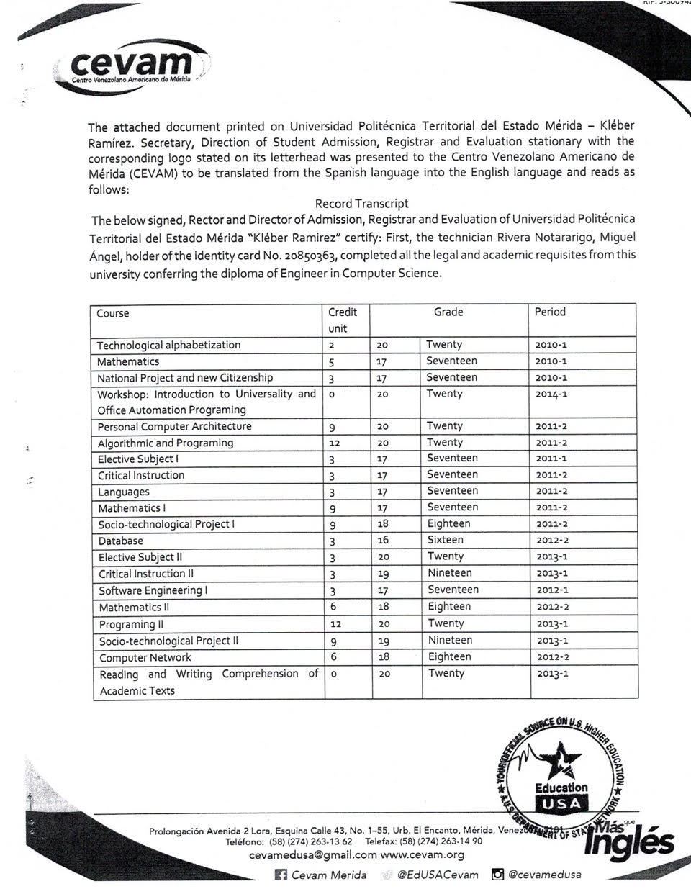
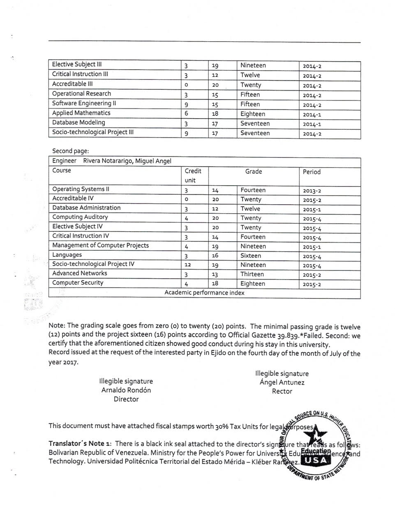
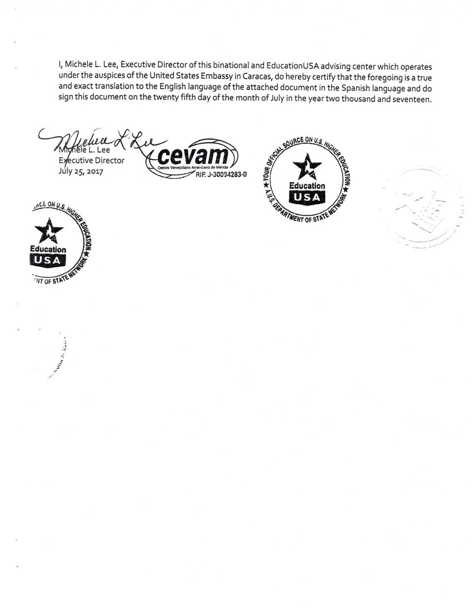
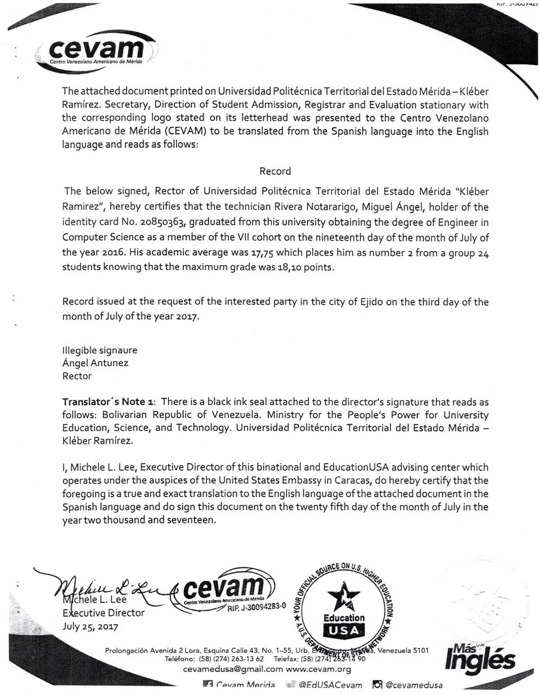
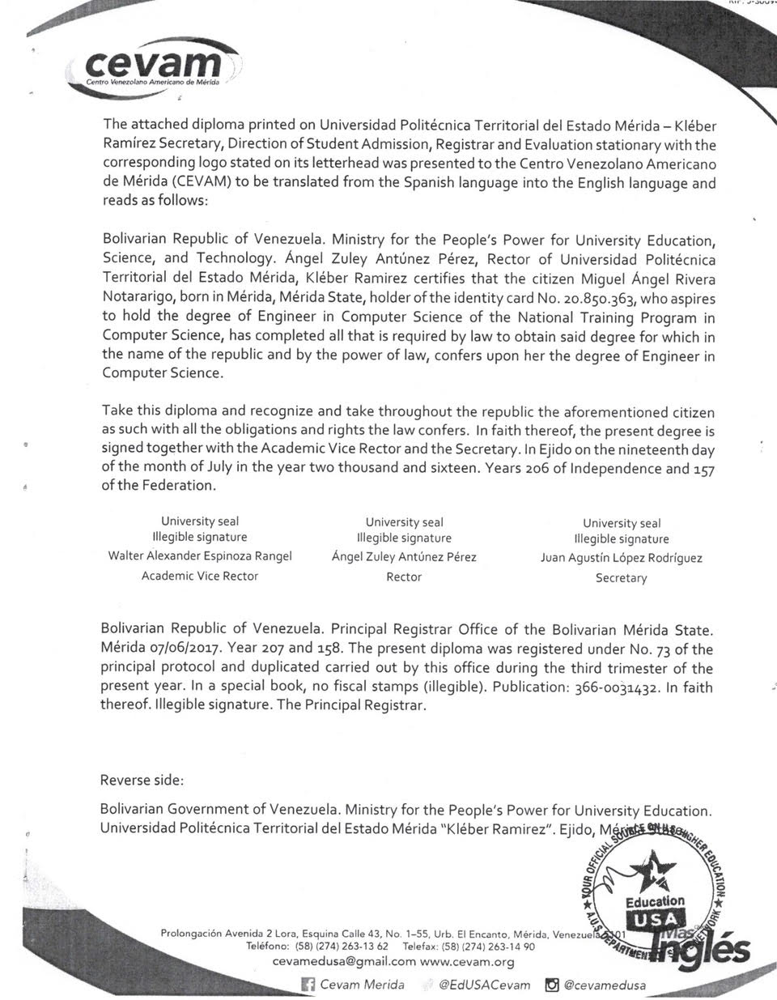
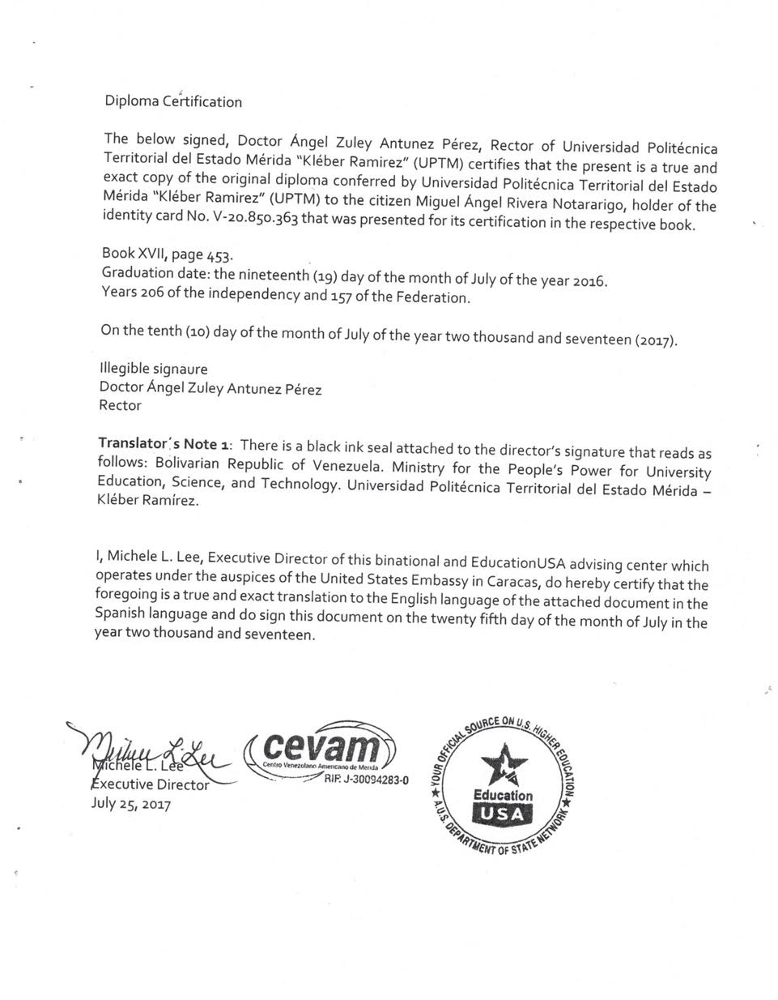
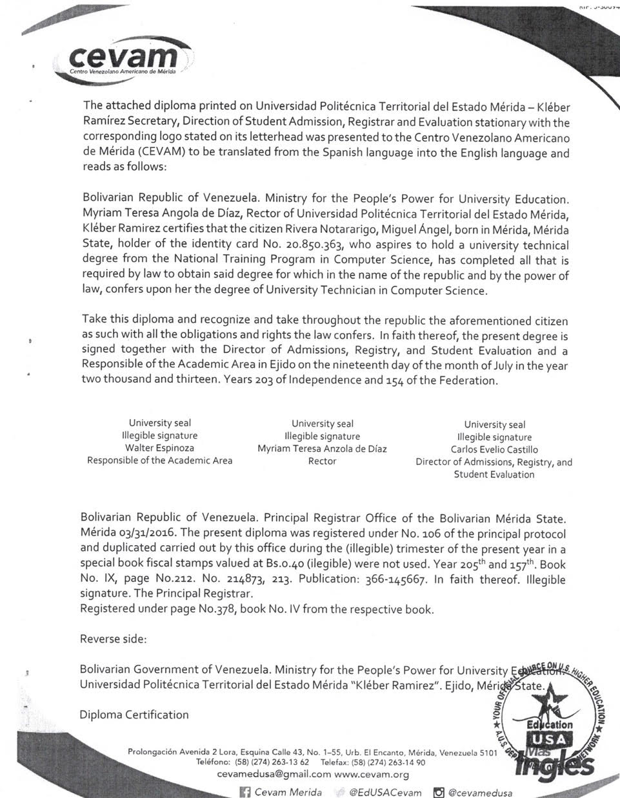
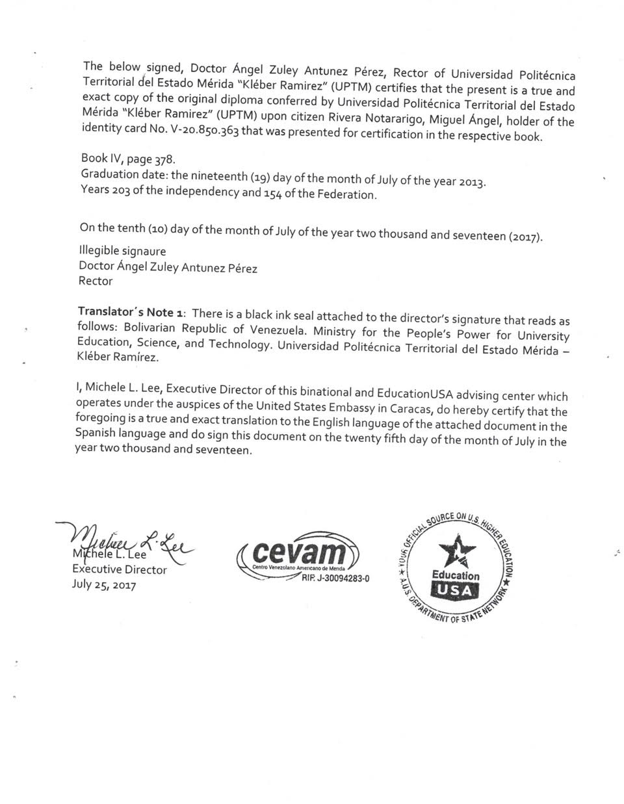
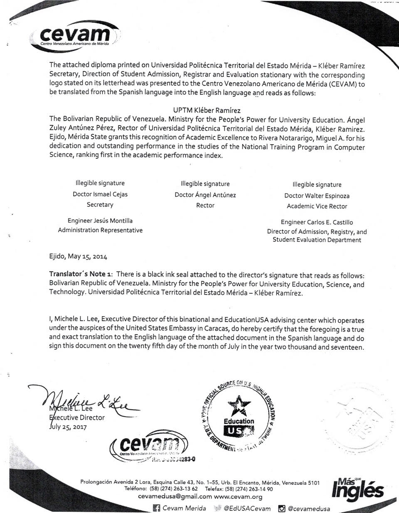

================
Curriculum Vitae
================

.. image:: images/facepic.jpg
    :height: 15em
    :class: article-image
    :alt: Face picture

**ID:** 20850363

**Name:** Miguel Angel Rivera Notararigo

**Citizenships:** Venezuelan, Italian

**Birth date:** 04/30/1992

**Address:** Av. Bolívar con calle Honduras #243, Ejido, Mérida, Venezuela

**Phone:** `+584247484276 <tel:+584247484276>`_

**Email:** ntrrgx@gmail.com

**Web site:** https://nt.web.ve/en

**GitHub:** https://github.com/ntrrg

Skills
======

Go and Shell Scripting advanced programming.

Familiarity with C, C++, JavaScript (Node.js) and Python.

Familiarity with modern Frontend technologies (HTML5, CSS3, ES6).

Static sites generators (Hugo).

Relational databases (MySQL, PostgreSQL, SQLite).

NoSQL databases (Badger).

Version control systems (Git).

Containers (Docker and systemd-nspawn).

Containers orchestration (Docker Swarm).

Cloud computing (GCP).

CI (Travis, Gilab CI, Drone) and CD (Netlify, Heroku).

Servers installation and configuration.

Basic networks configuration.

Technical support for Linux (Debian based), Android, iOS and Windows (>= XP)
devices.

English (intermediate level), Spanish (Native speaker).

|pb|

Experience
==========

* **Frontend developer**

  `Agrocompostela <https://agrocompostela.com>`_ - Remote

  2018/10 - 2018/11

  Create a corporate web site wth blog, ecommerce and more content.

  Hugo, HTML5, CSS3, JavaScript, Bootstrap, jQuery.

* **Fullstack developer**

  *KickOff* - Mérida, Venezuela

  2017/07 - 2018/06

  Create a high performance broadcasting application.

  Google Cloud Platform, JavaScript, Node.js, Express.js, Socket.io, MySQL,
  WebRTC, Licode, HTML5, CSS3, Webpack.

* **Backend developer**

  *Vultur* - Mérida, Venezuela

  2016/06 - 2017/06

  Create Odoo modules.

  Python, PostgreSQL, Odoo.

Education
=========

* **Full Stack Web Development**

  *freeCodeCamp*

  2018 - ...

* **Informatics Engineer**

  *Universidad Politécnica Territorial del Estado Mérida (UPTM)*

  2013 - 2016

* **B.S. in Informatics**

  *Universidad Politécnica Territorial del Estado Mérida (UPTM)*

  2010 - 2013

|pb|

Certifications and awards
=========================

* **Academic excelence**

  *Universidad Politécnica Territorial del Estado Mérida (UPTM)*

  2014/05

* **Computers technical support**

  *Universidad Politécnica Territorial del Estado Mérida (UPTM)*

  2013/05

Talks
=====

* **Desarrollo de alto rendimiento con Wheezy Web (High performance development
  with Wheezy Web)**

  http://www.python.info.ve/eventos/pytatuy-2016/

  Mérida, Venezuela

  2016/12/02

Projects
========

* **ntdocutils**

  https://nt.web.ve/en/projects/ntdocutils

  *Docutils theme manager.*

  Python.

* **ntgo**

  https://github.com/ntrrg/ntgo

  *A set of Go packages.*

  Go.

* **ntos**

  https://nt.web.ve/en/projects/ntos

  *Debian live system with encrypted persistence.*

  Shell scripting.

* **usersd**

  https://github.com/ntrrg/usersd

  *Authentication and authorization daemon.*

  Go.

.. raw:: html

    <h1 class="media-screen">Supports</h1>

|pb|

.. image:: images/pytatuy.jpg

|pb|

.. image:: images/academic_record.jpg

|pb|

.. image:: images/academic_record-2.jpg

|pb|

|pb|

|pb|

|pb|

.. image:: images/engineer_degree_record.jpg

|pb|

|pb|

.. image:: images/engineer_degree.jpg

|pb|

.. image:: images/engineer_degree-back.jpg

|pb|

|pb|

|pb|

.. image:: images/bachelor_degree_record.jpg

|pb|

.. image:: images/bachelor_degree_record-en.jpg

|pb|

.. image:: images/bachelor_degree.jpg
    :height: 70em

|pb|

.. image:: images/bachelor_degree-back.jpg

|pb|

|pb|

|pb|

.. image:: images/academic_excellence.jpg
    :height: 70em

|pb|

|pb|

.. image:: images/tecnic_support.jpg

|pb|

.. image:: images/tecnic_support-back.jpg

.. |pb| raw:: html

    

.. raw:: html

    

.. raw:: html

    

