================
Curriculum Vitae
================

**CI:** 20850363

**Nombre:** Miguel Angel Rivera Notararigo

**Nacionalidades:** Venezolano, Italiano

**Fecha de nacimiento:** 30/04/1992

**Dirección:** Av. Bolívar con calle Honduras #243, Ejido, Mérida, Venezuela

**Teléfono:** `+584247484276 <tel:+584247484276>`_

**Correo electrónico:** ntrrgx@gmail.com

**Sitio web:** https://nt.web.ve/es

**GitHub:** https://github.com/ntrrg

Habilidades
===========

Programación avanzada con Go y Shell Scripting.

Familiarizado con C, C++, JavaScript (Node.js) y Python.

Familiarizado con tecnologías Frontend modernas (HTML5, CSS3, ES6).

Generadores de sitios web estáticos (Hugo).

Bases de datos relacionales (MySQL, PostgreSQL, SQLite).

Bases de datos no relacionales (Badger).

Sistemas de control de versiones (Git).

Contenedores (Docker y systemd-nspawn).

Orquestación de contenedores (Docker Swarm).

Computación en la nuve (GCP).

CI (Travis, Gilab CI, Drone) y CD (Netlify, Heroku).

Instalación y configuración de servidores.

Configuración básica de redes.

Soporte a equipos Linux (Debian based), Android, iOS y Windows (>= XP).

Dominio intermedio del inglés.

|pb|

Experiencia
===========

* **Frontend developer**

  `Agrocompostela <https://agrocompostela.com>`_ - Remote

  2018/10 - 2018/11

  Crear un sitio web corporativo con blog, ecommerce o otros contenidos.

  Hugo, HTML5, CSS3, JavaScript, Bootstrap, jQuery.

* **Desarrollador Fullstack**

  *KickOff* - Mérida, Venezuela

  2017/07 - 2018/06

  Crear una aplicación de broadcasting de alto rendimiento.

  Google Cloud Platform, JavaScript, Node.js, Express.js, Socket.io, MySQL,
  WebRTC, Licode, HTML5, CSS3, Webpack.

* **Desarrollador Backend**

  *Vultur* - Mérida, Venezuela

  2016/06 - 2017/06

  Crear módulos para Odoo.

  Python, PostgreSQL, Odoo.

Formación académica
===================

* **Desarrollo Web Full Stack**

  *freeCodeCamp*

  2018 - ...

* **Ingeniero en Informática**

  *Universidad Politécnica Territorial del Estado Mérida (UPTM)*

  2013 - 2016

* **Técnico Superior en Informática**

  *Universidad Politécnica Territorial del Estado Mérida (UPTM)*

  2010 - 2013

|pb|

Certificación y reconocimientos
===============================

* **Excelencia Académica**

  *Universidad Politécnica Territorial del Estado Mérida (UPTM)*

  2014/05

* **Soporte Técnico**

  *Universidad Politécnica Territorial del Estado Mérida (UPTM)*

  2013/05

Charlas
=======

* **Desarrollo de alto rendimiento con Wheezy Web**

  http://www.python.info.ve/eventos/pytatuy-2016/

  Mérida, Venezuela

  2016/02/12

Proyectos
=========

* **ntdocutils**

  https://nt.web.ve/es/projects/ntdocutils

  *Gestor de temas para Docutils.*

  Python.

* **ntgo**

  https://github.com/ntrrg/ntgo

  *Conjunto de paquetes Go.*

  Go.

* **ntos**

  https://nt.web.ve/es/projects/ntos

  *Sistema Debian live con persistencia cifrada por defecto.*

  Shell scripting.

* **usersd**

  https://github.com/ntrrg/usersd

  *Demonio de autenticación y autorización.*

  Go.

.. raw:: html

    <h1 class="media-screen">Soportes</h1>

|pb|

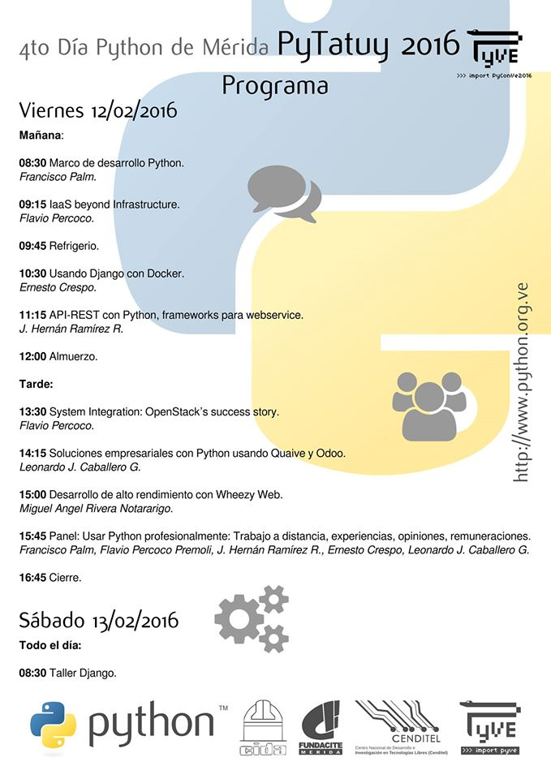

|pb|

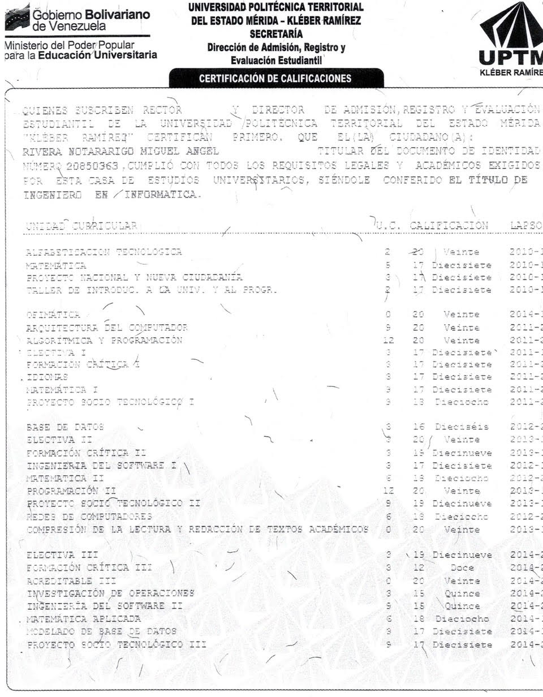

|pb|

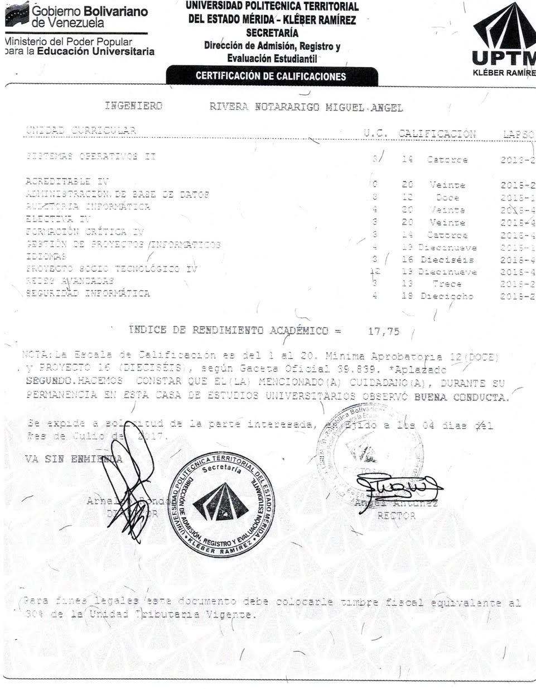

|pb|

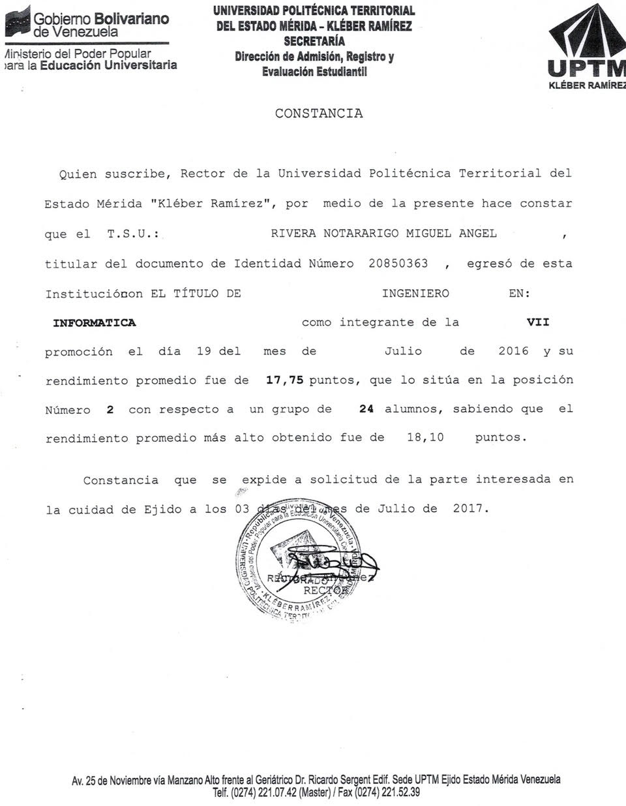

|pb|

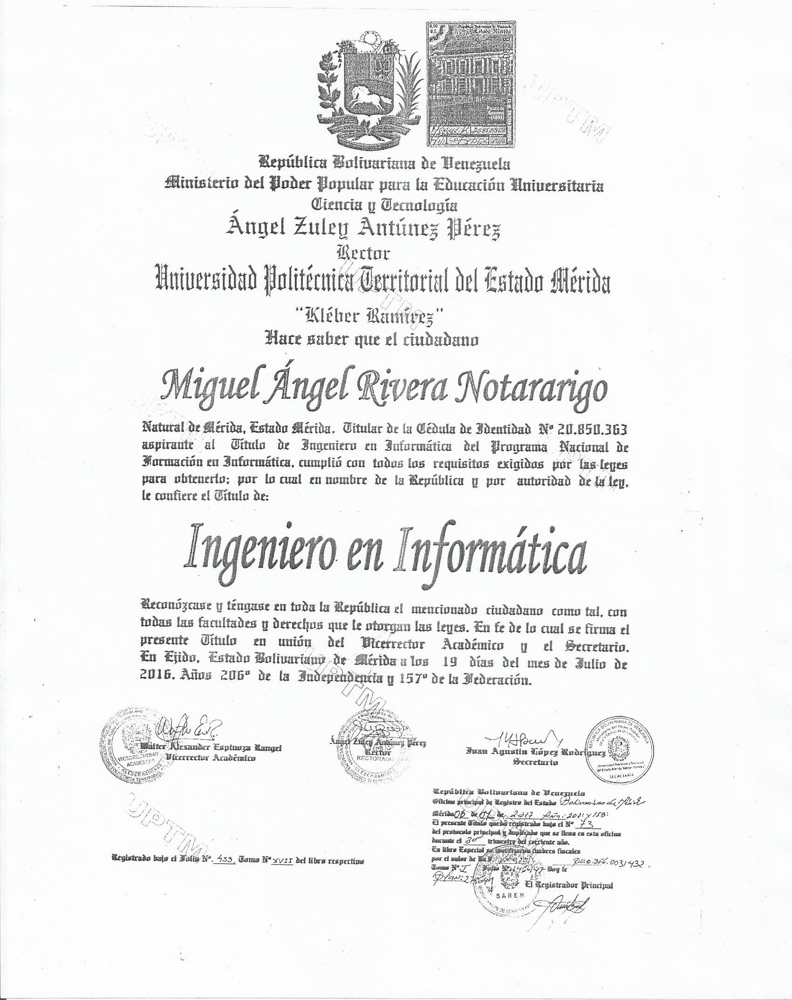

|pb|

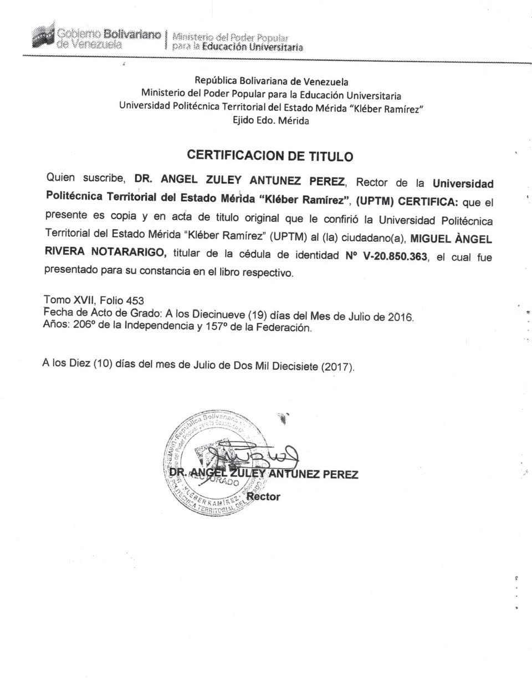

|pb|

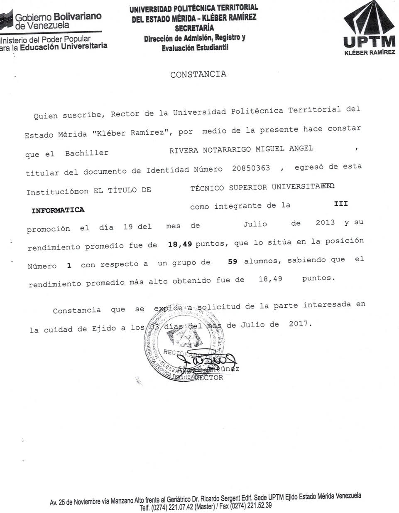

|pb|

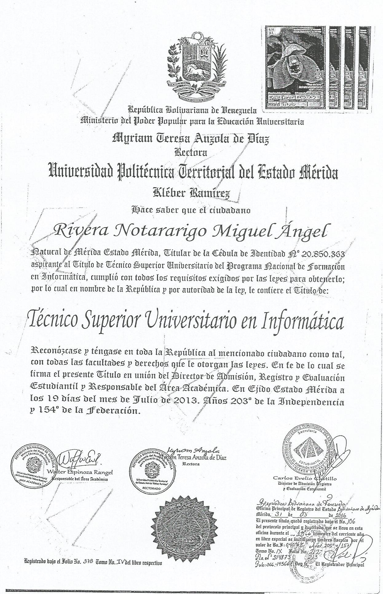

|pb|

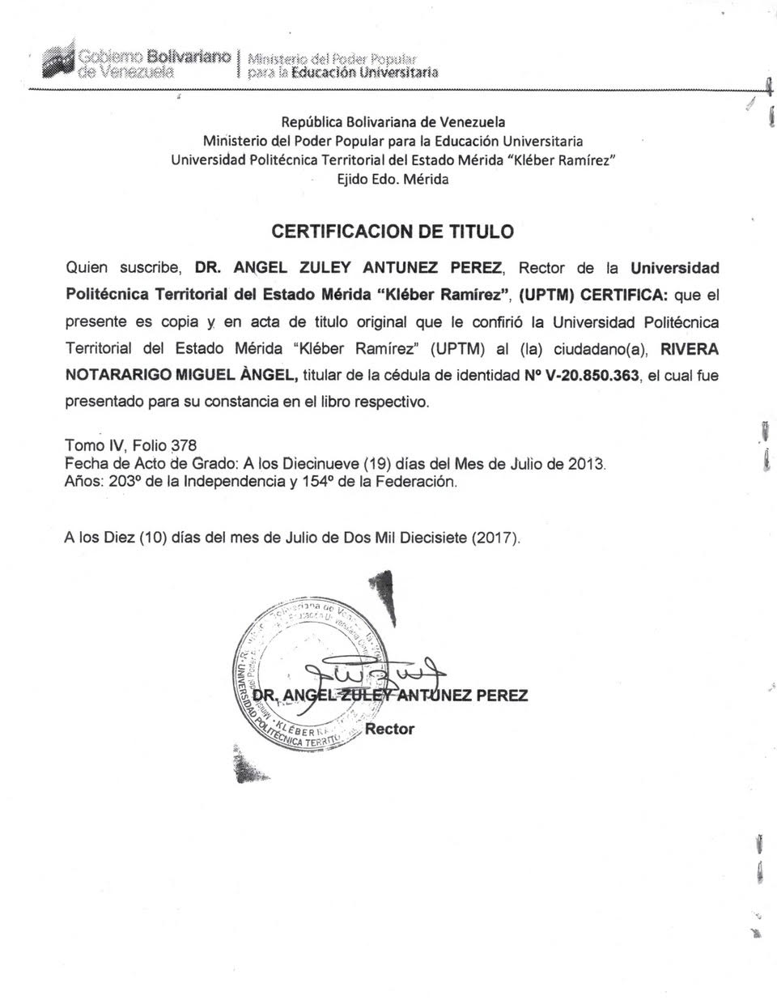

|pb|

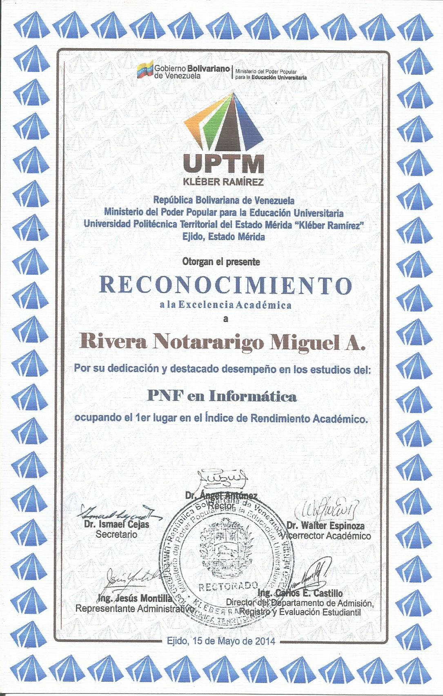

|pb|

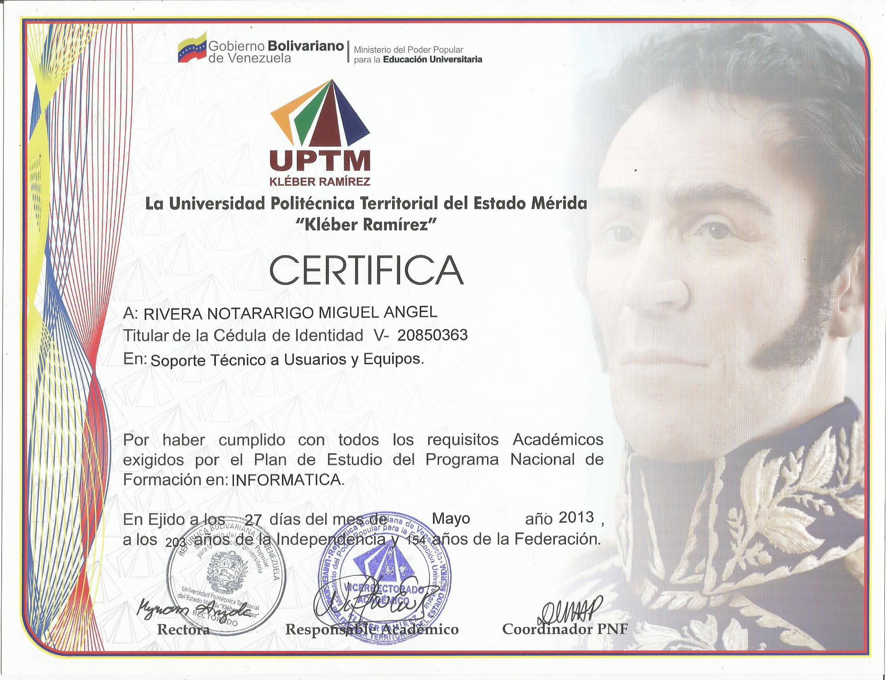

|pb|

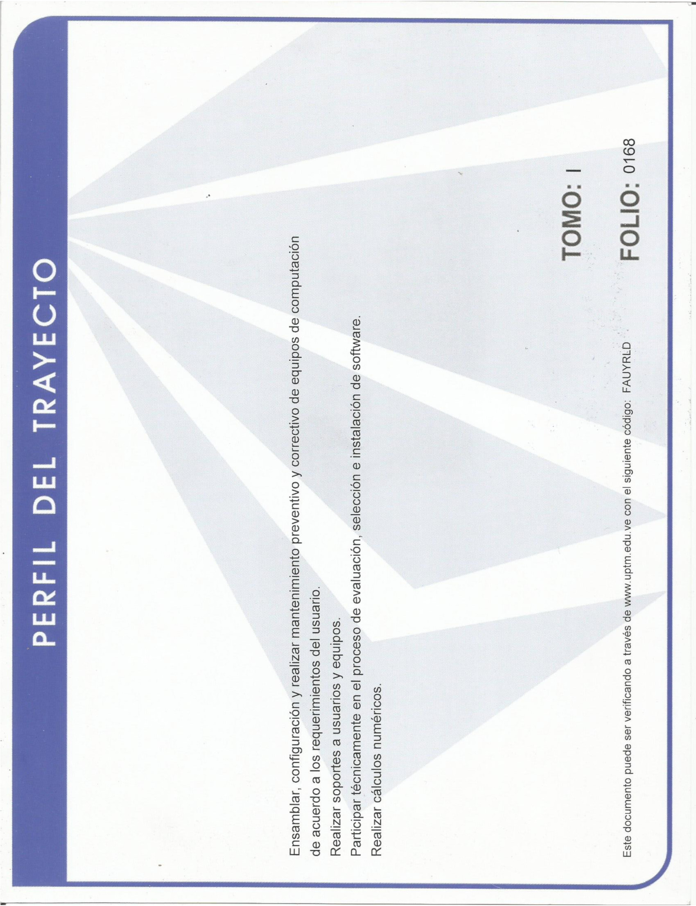

.. |pb| raw:: html

    

.. raw:: html

    

.. raw:: html

    

